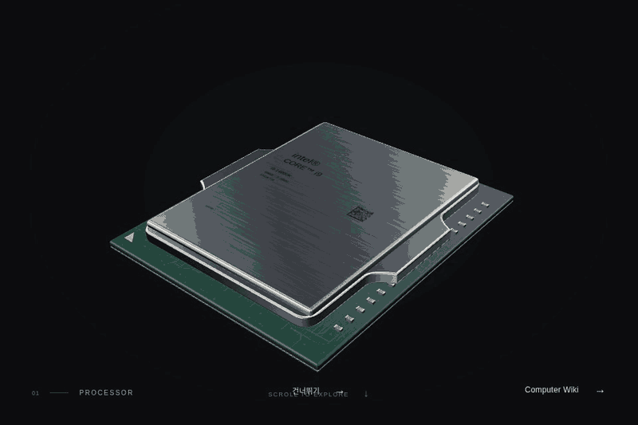
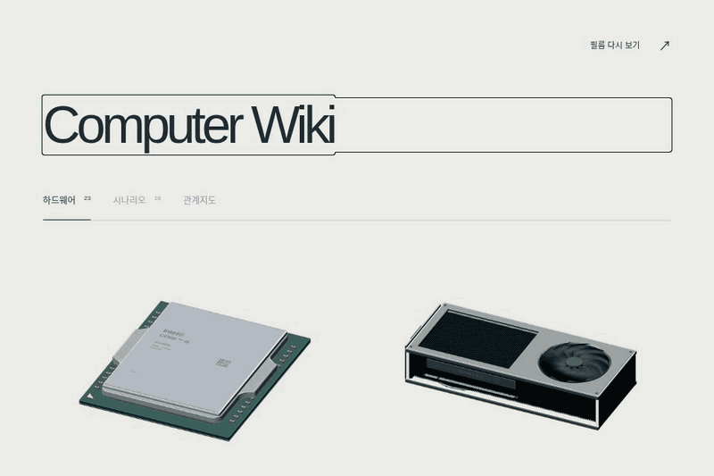
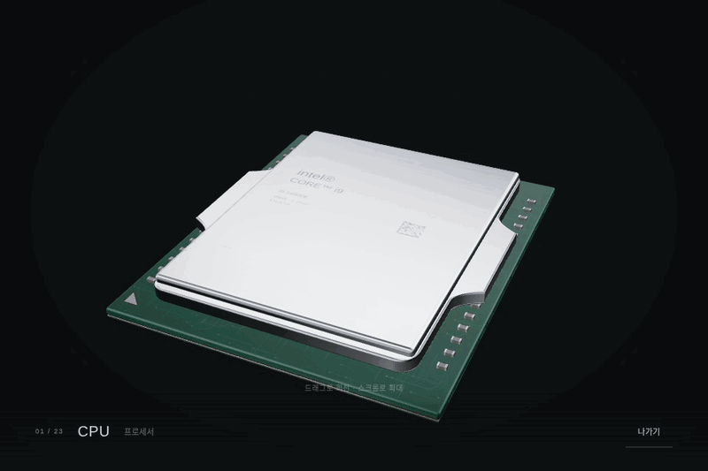
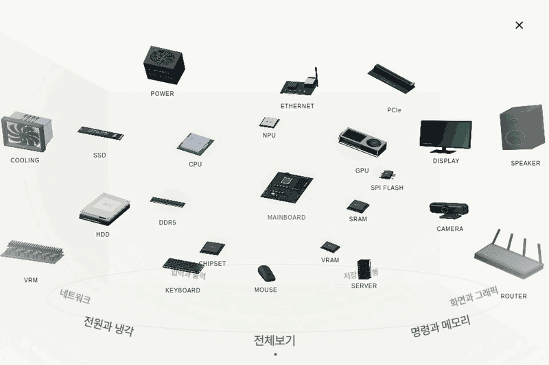
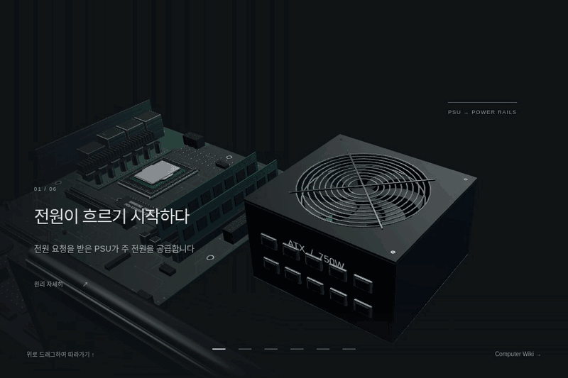
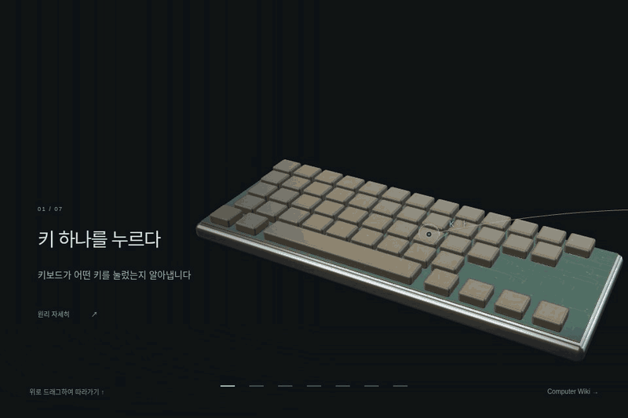

**[CAwiki 사이트 바로가기 →](https://leedonghyun00.github.io/CAwiki/)**

# CAwiki — Computer Wiki

컴퓨터 부품의 모습과 작동 원리, 서로 연결되는 이유를 눈으로 살펴보는 인터랙티브 위키입니다. **23종 하드웨어**를 탐색하고, **16개 시나리오**를 따라 입력·연산·저장·출력의 흐름을 이해할 수 있습니다.

처음에는 CPU에서 시작하는 필름이 재생됩니다. 바로 내용을 찾고 싶다면 [Computer Wiki 메인](https://leedonghyun00.github.io/CAwiki/#wiki)으로 이동하세요. 스크롤·드래그로 장면을 진행하거나 되돌리고, 부품을 눌러 자세히 살펴볼 수 있습니다.

## 페이지별 기능과 화면 미리보기

아래 GIF는 **2026-10-09 배포 사이트를 Chromium에서 직접 조작해 캡처**했습니다. 화면 크기는 960×640이며, README에는 가로 800px로 축소하고, 동선을 약 6–12초로 요약하도록 재생 속도를 조정했습니다. 실제 화면을 요약한 미리보기이며 FPS·로딩 속도를 측정하는 영상은 아닙니다. [캡처 출처와 파일 정보](docs/media/current/captures.json)

### 1. 필름 — 부품에서 하나의 컴퓨터로

[필름 열기](https://leedonghyun00.github.io/CAwiki/#home)

CPU, GPU, 메모리, 저장장치 등 부품이 펼쳐지고 메인보드에 모이는 과정을 보여 줍니다. 마지막에는 장면이 모니터 화면 안으로 이어지고 `Computer Wiki` 버튼으로 메인에 들어갈 수 있습니다. `건너뛰기`는 부품이 모인 **모니터 직전 장면**까지 빠르게 이동하며, 이후 스크롤하면 모니터가 나타납니다.

[](https://leedonghyun00.github.io/CAwiki/#home)

### 2. 메인 — 하드웨어와 시나리오 선택

[메인 열기](https://leedonghyun00.github.io/CAwiki/#wiki)

`하드웨어` 탭에서 CPU·GPU·DDR5·SSD·메인보드·주변기기 등 23종 부품을 고르고, `시나리오` 탭에서 일상 동작을 출발점으로 한 학습 주제를 선택합니다. `관계지도`는 시나리오 탭 옆에서 열 수 있습니다. 썸네일은 클릭·키 입력·파일 열기 등의 동작을 짧은 애니메이션으로 보여 줍니다.

[](https://leedonghyun00.github.io/CAwiki/#wiki)

### 3. 부품 보기 — 3D 모델 회전과 확대

[CPU 살펴보기](https://leedonghyun00.github.io/CAwiki/#object/cpu) · [GPU 살펴보기](https://leedonghyun00.github.io/CAwiki/#object/gpu) · [메인보드 살펴보기](https://leedonghyun00.github.io/CAwiki/#object/mainboard)

목록에서 선택한 부품을 독립된 3D 화면으로 보여 줍니다. 드래그로 회전하고, 휠이나 두 손가락으로 확대해 외형을 살펴봅니다. `나가기`로 목록에 돌아갈 수 있습니다.

[](https://leedonghyun00.github.io/CAwiki/#object/cpu)

### 4. 관계지도 — 역할, 내부 구성, 연결 관계

[관계지도 열기](https://leedonghyun00.github.io/CAwiki/#map)

부품들을 공간형 전시로 배치해 보여 줍니다. 주제를 고르고 부품을 선택하면 **역할 · 내부 구성 · 연결 관계**를 읽을 수 있습니다. 연결된 다른 부품을 선택해 두 부품이 함께 일하는 이유를 따라갑니다. 메인 목록과 같은 부품 이미지를 사용하고, 목록과 관계지도 사이의 이동도 이어지는 애니메이션으로 표현합니다.

[](https://leedonghyun00.github.io/CAwiki/#map)

### 5. 시나리오 — 사용자의 동작이 처리되는 과정

[전원이 켜지는 순간](https://leedonghyun00.github.io/CAwiki/#story/boot/0) · [키 하나가 글자가 되기까지](https://leedonghyun00.github.io/CAwiki/#story/typing/0)

스크롤에 맞춰 카메라, 부품, 신호 경로, 화면 출력이 바뀝니다. 각 단계에는 한국어 설명이 붙고, `원리 자세히`에서 더 긴 설명을 읽을 수 있습니다. 아래 단계 버튼으로 원하는 부분을 바로 다시 볼 수도 있습니다. 파일 열기 시나리오는 **SSD · HDD · 메모리 캐시** 경로를 비교합니다.

[](https://leedonghyun00.github.io/CAwiki/#story/boot/0)

[](https://leedonghyun00.github.io/CAwiki/#story/typing/0)

현재 열어 볼 수 있는 시나리오는 다음과 같습니다. 애니메이션은 학습을 위한 개념 표현으로, 실제 전자의 이동 속도나 모든 운영체제·하드웨어 구현을 재현하지는 않습니다.

| 시나리오 | 보여 주는 흐름 |
| --- | --- |
| [전원이 켜지는 순간](https://leedonghyun00.github.io/CAwiki/#story/boot/0) | 전원 공급 → 펌웨어 → 초기화 → 운영체제와 화면 |
| [클릭이 픽셀이 되기까지](https://leedonghyun00.github.io/CAwiki/#story/game/0) | 마우스 입력 → CPU·메모리 → GPU → 화면 |
| [검색 한 번의 여정](https://leedonghyun00.github.io/CAwiki/#story/search/0) | 검색어 입력 → 네트워크 → 서버 → 응답 |
| [파일을 여는 순간](https://leedonghyun00.github.io/CAwiki/#story/storage/0) | 저장장치·캐시 → 메모리 → 파일 표시 |
| [키 하나가 글자가 되기까지](https://leedonghyun00.github.io/CAwiki/#story/typing/0) | 키 입력 → 입력 보고 → 프로그램 처리 → 글자 표시 |
| [더블클릭에서 프로그램 실행까지](https://leedonghyun00.github.io/CAwiki/#story/launch/0) | 실행 요청 → 프로그램 읽기 → 메모리 적재 → 실행 |
| [Ctrl+S 한 번의 여정](https://leedonghyun00.github.io/CAwiki/#story/save/0) | 저장 명령 → 프로그램·운영체제 처리 → 저장장치 |
| [음악이 스피커에서 나오기까지](https://leedonghyun00.github.io/CAwiki/#story/music/0) | 오디오 데이터 → 디코딩·버퍼 → 오디오 출력 |
| [버퍼링 뒤에서 일어나는 일](https://leedonghyun00.github.io/CAwiki/#story/streaming/0) | 네트워크 수신 → 버퍼 → 디코딩 → 영상 재생 |
| [내 얼굴이 상대방에게 닿기까지](https://leedonghyun00.github.io/CAwiki/#story/call/0) | 카메라 → 인코딩 → 네트워크 → 상대 화면 |
| [여러 프로그램이 동시에 도는 법](https://leedonghyun00.github.io/CAwiki/#story/multitasking/0) | 여러 작업과 메모리 → CPU 스케줄링 → 화면 갱신 |
| [USB를 꽂는 순간](https://leedonghyun00.github.io/CAwiki/#story/usb/0) | 연결 감지 → 장치 인식 → 드라이버 → 사용 준비 |
| [잠들었다가 다시 깨어나는 법](https://leedonghyun00.github.io/CAwiki/#story/sleep/0) | 상태 보존 → 저전력 상태 → 깨우기 → 복원 |
| [질문이 AI의 답으로 돌아오기까지](https://leedonghyun00.github.io/CAwiki/#story/ai/0) | 요청 전송 → 서버의 모델 연산 → 응답 표시 |
| [게임 로딩 화면의 정체](https://leedonghyun00.github.io/CAwiki/#story/loading/0) | 게임 자산 읽기 → 메모리·GPU 준비 → 장면 표시 |
| [화면이 영상 파일이 되기까지](https://leedonghyun00.github.io/CAwiki/#story/record/0) | 화면 캡처 → 프레임 처리·인코딩 → 파일 저장 |

## 파일 구조

현재 메인 앱은 `index.html` 하나에서 `#wiki`, `#object/cpu`, `#map`, `#story/boot/0` 같은 해시 주소로 화면을 전환합니다. 관계지도 공간은 별도 HTML을 iframe으로 불러옵니다.

```text
CAwiki/
├── index.html                     # 메인 앱의 HTML·CSS·import map
├── relationship-room-study.html   # 현재 관계지도 공간의 화면 셸
├── lib/inside/                    # 현재 메인 앱의 ES 모듈
│   ├── site.js                    # 주소 라우팅, 목록, 화면 전환
│   ├── study.js                   # 필름 렌더러·공유 스테이지·모니터 전환
│   ├── cinema-timeline.js         # 필름 챕터와 진행 구간
│   ├── cinema-models.js           # 필름의 컴퓨터 조립 모델
│   ├── experience.js              # 개별 부품 3D 조작
│   ├── collection.js              # 부품 모델 생성·자원 해제
│   ├── models.js / hero.js        # 모델 지오메트리·재질 생성
│   ├── data.js / catalog.js       # 부품 목록과 표시 데이터
│   ├── room-host.js               # 부모 목록과 관계지도 iframe 연결
│   ├── room-study.js              # 공간 배치, 부품 상세, 연결 관계
│   ├── room-startup.js            # 관계지도 이미지 준비·픽셀 예산
│   ├── relation-source.js         # 원본 그래프에서 변환된 관계 데이터
│   ├── scenario-film.js           # 시나리오 카메라·진행·렌더링
│   ├── scenario-data.js           # 기본 시나리오와 저장 경로 변형
│   ├── scenario-extended-data.js  # 추가 시나리오 단계 데이터
│   ├── scenario-*.js              # 신호·동작·화면 출력·설명 표시
│   ├── story-*.js                 # SVG 썸네일과 키보드·USB 애니메이션
│   ├── quality.js                 # 기기별 지오메트리·텍스처 품질 예산
│   ├── prepare-programs.js        # 취소·컨텍스트 손실을 고려한 셰이더 준비
│   ├── render-status.js           # 준비 상태, 어두운 화면에서의 노출, 오류 복구
│   ├── scroll-pacing.js           # 모바일 장면 진행 속도 제한
│   ├── wiki-arrival.js            # 필름에서 목록으로 이어지는 전환
│   ├── three.js / orbit.js        # Three.js r170과 OrbitControls
│   └── assets.js                  # 생성된 자산 URL·해시 목록
├── assets/inside/
│   ├── redesign/                 # 목록·상세에서 사용하는 부품 이미지
│   ├── room/                     # 관계지도용 경량 이미지
│   ├── intro/                    # 첫 CPU 장면과 같은 모델로 만든 시작 이미지
│   ├── monitor/                  # 모니터 전환용 사전 렌더 이미지
│   └── scenarios/                # 시나리오 썸네일 자산
├── data/hardware-graph.json       # 하드웨어·부품·관계 지식 데이터
├── tools/
│   ├── build_inside_manifest.py  # 모듈·자산·iframe URL 해시 갱신
│   ├── build_cpu_intro.py        # CPU 시작 이미지 생성
│   ├── build_monitor_frames.py   # 모니터 이미지 생성
│   ├── build_room_previews.py    # 관계지도용 이미지 생성
│   ├── measure_*.py              # 로딩·렌더링·모바일 진행 측정
│   ├── test_*.py / test_*.mjs    # 화면 전환·복구·연속성 회귀 검사
│   └── capture_readme.py         # 실제 배포 사이트의 GIF 캡처
├── docs/
│   ├── media/current/            # README GIF·캡처 정보
│   ├── performance/              # 성능 실험 원본 JSON·비교표·검증 이미지
│   └── *.md                      # 설계·최적화·검증 기록
└── serve.py                      # 로컬 개발용 정적 HTTP 서버
```

### 이전 구현과 참고 문서

저장소에는 이전 도감·관계지도·SVG 시나리오도 남아 있습니다. 현재 메인 앱과 실행 경로가 다르므로, 메인 화면을 수정할 때는 위의 `lib/inside/`를 기준으로 작업합니다.

| 경로 | 역할 |
| --- | --- |
| `wiki.html`, `lib/wiki.js`, `assets/wiki.css` | 이전 아키텍처 도감 |
| `hardware.html`, `lib/hw-graph.js`, `lib/hw-visuals.js` | 이전 하드웨어 관계 탐색 |
| `scenarios/*.html`, `scenarios/*.js` | 이전 부팅·게임·검색·파일 열기 시나리오 |
| `lib/components.js`, `lib/stage.js`, `lib/scenario.js`, `lib/player.js` | 이전 SVG 컴포넌트와 단계 재생 |
| `lib/kernel.js`, `lib/cawiki.wasm`, `wasm/src/lib.rs` | 이전 SVG 애니메이션의 JS/Rust·WASM 계산 커널 |
| `docs/hardware/`, `docs/AUTHORING.md`, `docs/stack-decision.md` | 하드웨어 자료·기존 콘텐츠 제작 가이드·기술 선택 기록 |

## 사용 언어와 기술

| 기술 | 현재 사이트에서의 사용 |
| --- | --- |
| **HTML5 · CSS3** | 화면 셸, 반응형 목록, 설명·대화상자, 레이어 배치, 페이드와 썸네일 애니메이션. 3D와 별도로 텍스트·버튼은 DOM으로 유지합니다. |
| **JavaScript · ES Modules** | 해시 라우팅, 스크롤 진행률, 이벤트 처리, 모델 생성, 비동기 준비와 취소. import map으로 모듈을 연결하며 React나 별도 번들러를 사용하지 않습니다. |
| **Three.js r170 · WebGL** | 필름과 부품·시나리오의 지오메트리, 재질, 조명, 카메라를 렌더링합니다. 관계지도는 이미지 평면을 공간에 배치하고, OrbitControls는 부품 회전·확대를 담당합니다. |
| **SVG · Canvas 2D** | SVG로 시나리오 썸네일을 구성하고, Canvas 2D로 라벨·질감·모니터 화면 텍스처를 만듭니다. |
| **requestAnimationFrame · Web Animations API** | 장면 진행·카메라 움직임을 프레임에 맞추고, 준비 후 화면 노출 같은 전환을 표현합니다. |
| **JSON · Markdown** | 하드웨어 관계 데이터, 학습 자료, 설계 문서와 성능 측정 결과를 저장합니다. |
| **Python 3 · Playwright · Pillow** | 정적 개발 서버, 자산·해시 생성, Chromium 자동화, 스크린샷·GIF 제작 및 회귀 검증에 사용합니다. 사이트 방문자에게 Python은 필요하지 않습니다. |
| **GitHub Pages** | HTML·모듈·이미지를 정적으로 배포합니다. 메인 앱 실행에 별도 API 서버나 데이터베이스가 필요하지 않습니다. |

**Rust · WebAssembly**는 저장소의 **이전 SVG 페이지**에서 경로 샘플링·펄스·카메라 계산에 사용합니다. `lib/kernel.js`가 WASM을 불러오며 실패하면 JavaScript 구현으로 대체합니다. 현재 `lib/inside/`의 Three.js 렌더링을 Rust/WASM이 수행하는 구조는 아닙니다.

## 렌더링 최적화

### 필요한 자산과 작업만 준비하기

- 인라인 JavaScript·base64 이미지를 모듈과 개별 자산 파일로 분리해 브라우저가 각각 요청·캐시하도록 했습니다. 파일 내용 해시를 URL에 넣어 변경된 자산을 갱신합니다.
- Wiki에 직접 들어오면 목록을 먼저 보여 주며, 필요하지 않은 3D 스테이지를 바로 생성하지 않습니다. 필름을 떠나면 진행 중인 모델 생성도 부품 사이에서 중단합니다.
- 첫 CPU를 먼저 준비하고, 스크롤 중 모니터 자산을 비동기로 준비합니다. 모니터 전환은 사전 렌더 이미지가 기본이며, 필요한 경우 라이브 RTT(Render-to-Texture) 경로를 사용합니다.
- 관계지도 이미지 디코딩은 최대 4개를 동시에 처리합니다. 전체 전시는 경량 이미지를 쓰고, 상세와 연결 부품에 필요한 원본만 유지합니다. USB 썸네일 자산도 화면 근처에서 준비합니다.

### GPU·메모리 비용 제한하기

- `quality.js`에서 모바일·터치 기기의 DPR, 텍스처 크기, 곡면 분할 수를 제한합니다. 모바일 기본 DPR 상한은 1, 일반 절차적 텍스처 최대 변은 512px, 라벨은 128px입니다. 실시간 그림자는 기본 설정에서 사용하지 않습니다.
- 관계지도 주 캔버스에는 데스크톱 **144만**, 모바일 **81만 픽셀** 예산을 적용합니다. DOM 설명과 버튼의 CSS 해상도는 그대로 유지합니다.
- 관계지도에 들어가면 사용하지 않는 부모 필름의 렌더 버퍼·모니터 타깃을 1×1로 줄입니다. 다시 필요할 때 복구합니다.
- 움직임이나 변경이 있을 때 렌더링하고, 숨은 문서의 프레임 루프를 중단합니다. 모바일 시나리오의 동적 화면 텍스처 갱신은 이동 중 최대 24Hz로 제한합니다.
- 공유 스테이지는 재사용하고, 시나리오를 떠날 때 추가 모델·경로의 geometry, material, texture를 해제해 방문할수록 자원이 쌓이는 일을 줄입니다.

### 첫 진입과 전환을 끊기지 않게 만들기

- 셰이더·이미지 업로드를 전환 전에 준비하고, 경로 변경 토큰과 `AbortController`로 오래된 작업을 취소합니다. 관계지도 준비에는 8초 제한과 이미지 탐색 복구 경로를 둡니다.
- 200ms 이내의 준비에는 별도 노출 연출을 추가하지 않습니다. 오래 걸리는 장면은 검정 화면에서 서서히 보여 주며, 관계지도 준비 중에는 부품 이미지를 유지한 채 주변 UI를 페이드아웃합니다.
- 관계지도 복귀 때 부모 목록의 실제 이미지와 레이아웃을 유지하고, 캔버스가 사라지기 전에 목록 이미지를 표시해 사라짐·잘림·위치 점프를 줄였습니다.
- 모바일 터치 진행은 **초당 최대 1장면**, 지연된 한 프레임은 **장면의 최대 5%**로 제한합니다. 과도한 관성 목표도 제한해 강한 드래그로 여러 장면이 한꺼번에 지나가는 일을 막습니다. 건너뛰기·단계 버튼은 의도적인 이동이므로 별도로 처리합니다.

### 무엇을 측정했는가

준비 완료 시점, 전환 경과 시간, 50ms 초과 Long Task, rAF 프레임 간격, 렌더 호출·삼각형 수, 텍스처 크기, JS 힙, 자산 응답 크기와 화면 위치·픽셀 연속성을 기록했습니다.

| 검증 항목 | 기록된 변화·결과 | 기록 |
| --- | --- | --- |
| 4K/DPR 2 관계지도 주 캔버스 | 기존 18,662,400픽셀에서 데스크톱 1,440,000픽셀 이하로 제한 | [첫 진입 안정화](docs/cold-gallery-startup.md) |
| 큰 관성 입력의 장면 건너뜀 | 키보드 시나리오 한 렌더 프레임 최대 2.546 → 0.050장면 | [모바일 진행 속도](docs/mobile-scroll-pacing.md) |
| 관계지도에서 목록으로 복귀 | 문구 정리 이후 PC·모바일 부품 위치 차이 모두 0px | [회귀 검사 원본](docs/performance/mobile-scroll/wiki-return/checks.json) |

수치는 각 문서에 명시한 테스트 환경과 시점의 결과입니다. **Chromium 모바일 에뮬레이션·소프트웨어 WebGL 결과를 실제 휴대폰 FPS나 VRAM으로 해석하지 않습니다.** 모바일 속도 제한은 장면 건너뜀을 개선한 것이며 GPU 처리 속도 향상을 뜻하지 않습니다. 초기 리팩토링부터의 실험과 한계는 아래 문서에서 확인할 수 있습니다.

- [렌더링 리팩토링 설계와 측정 방법](docs/rendering-performance.md)
- [문구 없는 로딩과 자산 준비](docs/loading-rendering.md)
- [새 Chrome의 관계지도 첫 진입 안정화](docs/cold-gallery-startup.md)
- [필름·부품·시나리오 외형과 전환 일관성](docs/visual-continuity.md)
- [관계지도 복귀 연속성](docs/wiki-return-continuity.md)
- [모바일 드래그 속도 제한과 후보 비교](docs/mobile-scroll-pacing.md)

## 로컬 실행과 수정

Python 3가 있으면 저장소 루트에서 실행할 수 있습니다. 일반 실행에는 npm 설치나 Rust 빌드가 필요하지 않습니다.

```sh
python3 serve.py
# http://localhost:4173/
```

메인 앱의 모듈이나 자산을 변경했다면 콘텐츠 해시를 갱신하고, 생성된 HTML·자산 목록·호스트 파일도 함께 반영합니다.

```sh
python3 tools/build_inside_manifest.py
```

브라우저 검증에는 Python Playwright와 Chromium이 필요하고, 진행 속도 단위 검사에는 Node.js를 사용합니다. 아래 스크립트들은 기본적으로 `/usr/bin/chromium`을 사용합니다. 측정과 브라우저 검사는 서로 겹치지 않게 실행합니다.

```sh
python3 -m pip install playwright pillow
node tools/test_scroll_pacing.mjs
python3 tools/measure_mobile_scroll.py --out /tmp/mobile-scroll.json --strict
python3 tools/test_wiki_return.py --out /tmp/wiki-return --strict
```

README GIF는 로컬 모형이 아니라 기본 URL의 **배포 사이트**를 캡처합니다. 변경을 배포한 뒤 재생성합니다. 캡처 파일과 출처 정보는 `docs/media/current/`에 저장됩니다.

```sh
python3 tools/capture_readme.py
# 특정 화면만 재생성
python3 tools/capture_readme.py --only wiki map
# Chromium 경로가 다른 환경
python3 tools/capture_readme.py --browser /path/to/chromium
```
