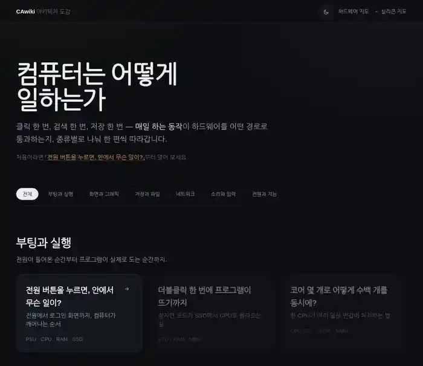

**[CAwiki 바로가기](https://leedonghyun00.github.io/CAwiki/)** · [아키텍처 도감](https://leedonghyun00.github.io/CAwiki/wiki.html) · [하드웨어 관계 지도](https://leedonghyun00.github.io/CAwiki/hardware.html)

# CAwiki

**컴퓨터 안에서 벌어지는 일과 하드웨어 사이의 관계를 눈으로 탐색하는 인터랙티브 위키입니다.**

전원을 켜고, 게임을 하고, 검색하고, 파일을 여는 익숙한 동작에서 출발합니다. CPU·GPU·메모리·저장장치가 각각 무엇을 하는지, 어떤 부품과 함께 일하는지, 데이터가 어디를 거쳐 이동하는지 살펴볼 수 있습니다.

## 이곳에서 할 수 있는 일

### 일상 동작을 따라 컴퓨터의 처리 과정 이해하기

단계별 애니메이션과 설명을 함께 보며, 하나의 동작에 참여하는 하드웨어와 신호의 흐름을 확인할 수 있습니다. 관심 있는 단계를 다시 살펴보며 전체 과정과 개별 부품의 역할을 연결해 이해할 수 있습니다.

아키텍처 도감에서 바로 열어 볼 수 있는 시나리오는 다음 네 편입니다.

| 시나리오 | 살펴볼 수 있는 내용 |
| --- | --- |
| [컴퓨터 부팅](https://leedonghyun00.github.io/CAwiki/scenarios/boot.html) | 전원 버튼을 누른 뒤 컴퓨터가 깨어나 로그인 화면에 도달하기까지의 과정 |
| [게임 입력과 화면](https://leedonghyun00.github.io/CAwiki/scenarios/game.html) | 마우스 입력이 CPU·GPU의 처리를 거쳐 화면의 픽셀이 되는 과정 |
| [인터넷 검색](https://leedonghyun00.github.io/CAwiki/scenarios/search.html) | 검색 요청이 네트워크 장치와 서버를 오가고 결과가 돌아오는 과정 |
| [파일 열기](https://leedonghyun00.github.io/CAwiki/scenarios/storage.html) | 저장장치의 데이터가 메모리와 CPU를 거쳐 사용되는 과정 |

### 부품 이름을 넘어 하드웨어의 연결 관계 탐색하기

[하드웨어 관계 지도](https://leedonghyun00.github.io/CAwiki/hardware.html)에서는 CPU·GPU·RAM·SSD를 비롯한 **21종 하드웨어**의 역할과 서로 연결되는 이유를 살펴볼 수 있습니다. 내부 부품, 사양, 관련 개념까지 관심에 맞춰 탐색할 수 있습니다.

| 학습 단계 | 제공하는 탐색 경험 |
| --- | --- |
| 입문 | CPU·RAM·GPU·SSD·메인보드·전원, 핵심 여섯 가지를 쉬운 설명과 비유로 이해 |
| 표준 | 선택한 하드웨어와 주변 부품의 관계를 중심으로 자유롭게 탐색 |
| 전문가 | 전체 관계 지도와 개요·관계·부품·사양·개념을 함께 살펴보기 |

### 궁금한 주제만 골라 읽기

[아키텍처 도감](https://leedonghyun00.github.io/CAwiki/wiki.html)은 주제를 **부팅과 실행 · 화면과 그래픽 · 저장과 파일 · 네트워크 · 소리와 입력 · 전원과 지능**으로 나눠 보여 줍니다. 카테고리별로 관심 있는 내용을 추려 보고, 각 시나리오에 등장하는 하드웨어도 미리 확인할 수 있습니다.

도감에서는 다크·라이트 테마를 선택할 수 있으며, 열어 본 시나리오는 `읽음` 표시로 구분할 수 있습니다.

> 도감에 등록된 15개 주제 중 현재 연결된 시나리오는 위 네 편입니다. 나머지 카드는 준비 중인 콘텐츠로, 아직 열 수 없습니다.

## 화면 미리보기

[](https://leedonghyun00.github.io/CAwiki/wiki.html)

<sub>도감 소스 기반 로컬 렌더링 캡처 · 다크/라이트 화면 순환 · 2026-10-08</sub>

## 현재 메인 화면과 성능 검증

현재 `index.html`의 필름·모니터·관계지도·스크롤 시나리오는 Three.js 앱이며,
실행 코드는 `lib/inside/`, 개별 이미지 자산은 `assets/inside/`에 있습니다.
기존 `wiki.html`, `hardware.html`, `scenarios/*.html`은 아래에 설명한 SVG/WASM 구조를 사용합니다.

메인 코드나 자산을 수정한 뒤 `python3 tools/build_inside_manifest.py`로 캐시 버전 URL을 갱신합니다.
생성된 파일을 포함해 정적 서버에 그대로 올리면 되며 런타임 빌드는 필요 없습니다.

[메인↔관계지도 화면 인계 수정](docs/room-handoff.md)에 준비 중 부품이 사라지는 원인, 원래 목록 유지, 버튼 재배치와 프레임·성능 비교를 기록했습니다.

[외형·전환 일관성 후속 수정](docs/visual-continuity.md)에 CPU 시작 화면, 관계지도 전환, 시나리오 첫 프레임 및 키보드 썸네일의 검증 결과를 정리했습니다.

[문구 없는 로딩·새 공간 관계지도 개선](docs/loading-rendering.md)에 앞선 UX 개선과 측정 결과를 정리했습니다.

[렌더링 리팩토링 설계·실험 기록](docs/rendering-performance.md)에 병목 근거, 품질 예산,
로딩·복구 UX, 반복 측정 방법, 원본 수치와 실기기 검증 과제를 정리했습니다.
`tools/measure_rendering.py`로 성능을 측정하고 `tools/test_rendering.py`로 화면 전환을 검증합니다.

## 주요 파일 경로

```text
CAwiki/
├── index.html                    # 메인 탐색 페이지
├── wiki.html                     # 아키텍처 도감
├── hardware.html                 # 하드웨어 관계 지도
├── scenarios/
│   ├── boot.html / boot.js        # 컴퓨터 부팅 시나리오
│   ├── game.html / game.js        # 게임 입력과 화면 시나리오
│   ├── search.html / search.js    # 인터넷 검색 시나리오
│   └── storage.html / storage.js  # 파일 열기 시나리오
├── assets/
│   ├── style.css                 # 시나리오·스테이지 공통 스타일
│   ├── wiki.css                  # 아키텍처 도감 스타일
│   └── hardware.css              # 하드웨어 관계 지도 스타일
├── lib/
│   ├── wiki.js                   # 도감 데이터·카테고리·카드·테마
│   ├── hw-graph.js               # 하드웨어 관계 탐색·학습 단계
│   ├── hw-visuals.js             # 하드웨어 시각 표현
│   ├── components.js             # 하드웨어 SVG 컴포넌트
│   ├── stage.js                  # 다이어그램·연결선·시각 상태
│   ├── scenario.js               # 시나리오 구성
│   ├── player.js                 # 단계별 시나리오 재생
│   ├── kernel.js                 # 애니메이션 계산·JS 대체 구현
│   └── cawiki.wasm               # WebAssembly 애니메이션 커널
├── data/
│   └── hardware-graph.json       # 하드웨어·부품·관계 데이터
├── wasm/
│   └── src/lib.rs                # 애니메이션 커널 Rust 소스
├── tools/
│   ├── build_graph.py            # 하드웨어 그래프 데이터 생성
│   └── hardware-*.json           # 하드웨어 조사·관계 원천 데이터
├── docs/
│   ├── media/wiki-preview.webp   # README 화면 미리보기
│   ├── hardware/                 # 하드웨어별 상세 문서
│   ├── AUTHORING.md              # 콘텐츠 제작 가이드
│   └── stack-decision.md         # 기술 선택 근거
├── serve.py                      # 로컬 개발 서버
└── start.command                 # 로컬 실행 보조 스크립트
```

## 주요 기술 스택

| 영역 | 기술 | 활용 |
| --- | --- | --- |
| 화면 구성 | HTML5, CSS3 | 페이지 레이아웃, 반응형 스타일, 다크·라이트 테마 |
| 상호작용 | JavaScript, ES Modules | 도감 필터, 관계 탐색, 단계별 시나리오 재생 |
| 시각화 | SVG, CSS, `requestAnimationFrame` | 하드웨어 다이어그램, 연결선, 신호 흐름 애니메이션 |
| 애니메이션 계산 | Rust, WebAssembly | 경로·펄스·카메라 계산. WebAssembly 로드 실패 시 JavaScript 구현 사용 |
| 콘텐츠·상태 | JSON, Markdown, `localStorage` | 하드웨어 지식 데이터, 상세 문서, 테마 및 방문 기록 |
| 개발 도구 | Python 3, Cargo | 로컬 정적 서버, 그래프 데이터 생성, Rust 커널 빌드 |
| 배포 | GitHub Pages | 정적 웹사이트 배포 |

콘텐츠 제작과 구현에 관한 자세한 내용은 [제작 가이드](./docs/AUTHORING.md), [기술 선택 근거](./docs/stack-decision.md), [하드웨어 문서](./docs/hardware/README.md)에서 확인할 수 있습니다.
