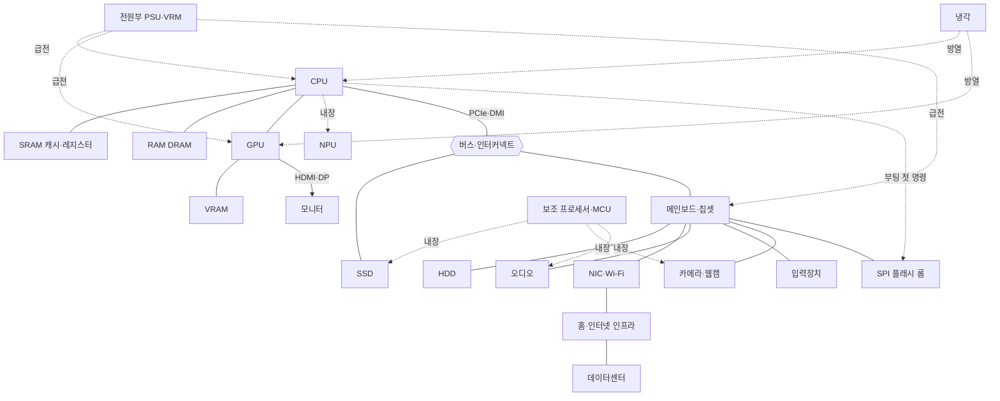

# 하드웨어 도감 — 조사 자료

CAwiki가 다루는 하드웨어를 **작동방식 · 내부 부품 · 핵심 개념 · 대표 사양 · 흔한 오해 · 비유 · 연관 하드웨어 · 등장 시나리오**로 정리한 조사 문서 모음입니다.
총 **21개** 항목. 각 문서는 **심층 조사 → 기술 정확성 적대 검증 → 완결성 감수(역할·부품·부품별 역할·연관 하드웨어 4기준)** 3단계를 거쳤습니다.

> 출처 카탈로그: [`scenarios-and-hardware.md`](../../scenarios-and-hardware.md) §3 하드웨어 전체 카탈로그

## 🔌 하드웨어 연결 지도

빠른 장치는 CPU에 직결하고, 느린 다수는 칩셋(PCH)이 모아 전달합니다. 각 문서의 **연관 하드웨어** 표에 세부 연결이 있습니다.

## 연산

| # | 하드웨어 | 한 줄 정의 | 부품 | 개념 | 연관 |
|---|---|---|---|---|---|
| 01 | **[CPU (중앙처리장치)](01-cpu.md)** Central Processing Unit (CPU) | 메모리에 담긴 프로그램 명령어를 하나씩 가져와 해석하고 실행해, 컴퓨터의 거의 모든 범용 계산과 제어·조율을 담당하는 핵심 연산 장치. | 17 | 18 | 16 |
| 02 | **[그래픽처리장치 (GPU)](02-gpu.md)** Graphics Processing Unit (GPU) | 수천 개의 작은 코어로 같은 계산을 대규모 병렬로 수행해, 화면 픽셀을 그리는 그래픽 렌더링과 행렬 연산(AI·과학계산)을 초고속으로 처리하는 대량 병렬(throughput) 프로세서. | 19 | 16 | 17 |
| 03 | **[신경망처리장치 (NPU)](03-npu.md)** Neural Processing Unit (NPU) | 신경망의 핵심인 행렬곱·합성곱(수많은 곱셈-누산)을 저정밀·저전력으로 대량 병렬 처리하도록 특화된, 주로 온디바이스 추론을 담당하는 도메인 특화 AI 가속기. | 11 | 17 | 11 |
| 21 | **[보조 프로세서·마이크로컨트롤러](21-coproc.md)** Co-processors & Microcontrollers | 메인 CPU를 도와 특정 작업 한 가지를 저전력·실시간으로 전담하는, 시스템 곳곳에 숨은 '작은 완결형 컴퓨터'들(SSD 컨트롤러·웹캠 ISP·오디오 DSP·임베디드 컨트롤러·키보드 MCU·NPU 등). | 14 | 16 | 17 |

## 메모리

| # | 하드웨어 | 한 줄 정의 | 부품 | 개념 | 연관 |
|---|---|---|---|---|---|
| 04 | **[SRAM (정적 램) — 레지스터·캐시](04-sram.md)** SRAM (Static RAM) — Registers & Cache | 트랜지스터 래치로 1비트를 리프레시 없이 붙잡아 두는, CPU 코앞의 가장 빠른 메모리 — 레지스터 파일과 L1·L2·L3 캐시를 이룬다. | 18 | 18 | 8 |
| 05 | **[램 (주기억장치, DRAM)](05-dram.md)** DRAM (Dynamic Random Access Memory) — Main Memory | 아주 작은 커패시터에 담긴 전하(있음/없음)로 0과 1을 저장해, CPU가 '지금' 실행 중인 프로그램과 데이터를 넓게 펼쳐 두는, 빠르지만 전원이 꺼지면 내용이 사라지는 휘발성 주기억장치. | 18 | 18 | 16 |
| 06 | **[그래픽 메모리 (VRAM)](06-vram.md)** Video RAM (VRAM) | GPU 바로 옆에 붙어, 화면·텍스처·AI 가중치 같은 대용량 데이터를 초당 수백 GB~수 TB로 퍼올리는, 지연(latency)보다 '처리량(대역폭)'을 위해 설계된 전용 DRAM. | 13 | 16 | 9 |

## 저장장치

| # | 하드웨어 | 한 줄 정의 | 부품 | 개념 | 연관 |
|---|---|---|---|---|---|
| 07 | **[SSD (솔리드 스테이트 드라이브)](07-ssd.md)** Solid State Drive (SSD) | 회전 원판·헤드 같은 움직이는 부품 없이, NAND 플래시 셀에 전하를 가둬 데이터를 기록·유지하는 비휘발성 반도체 저장장치. | 13 | 22 | 11 |
| 08 | **[하드디스크 드라이브](08-hdd.md)** HDD (Hard Disk Drive) | 일정 속도로 회전하는 자기 플래터에 데이터를 자화(N/S) 패턴으로 새기고, 표면 위 몇 나노미터에 떠 있는 자기 헤드로 읽고 쓰는 기계식 대용량 비휘발성 저장장치. | 16 | 17 | 7 |
| 09 | **[SPI 플래시 롬 (부트 롬)](09-spirom.md)** SPI Flash ROM (Boot ROM) | 메인보드에 붙어 UEFI/BIOS 펌웨어를 담고, 전원이 켜지자마자 CPU가 (칩셋 매핑을 통해) 가장 먼저 첫 명령을 읽어 가는 비휘발성 NOR 플래시 칩 — 컴퓨터 부팅의 물리적 출발점. | 10 | 13 | 7 |

## 기판·버스·전원

| # | 하드웨어 | 한 줄 정의 | 부품 | 개념 | 연관 |
|---|---|---|---|---|---|
| 10 | **[메인보드·칩셋(PCH)](10-mainboard.md)** Motherboard & Chipset (Platform Controller Hub) | 모든 부품을 물리적으로 꽂아 연결하고, 전원을 정밀하게 나눠주며, CPU에 직결되지 않는 저속·다수 장치를 칩셋(PCH)이 모아 DMI 한 링크로 CPU에 이어주는 컴퓨터의 기반 배선판이다. | 17 | 15 | 14 |
| 11 | **[버스·인터커넥트](11-bus.md)** Buses & Interconnects | CPU·메모리·저장장치·주변기기를 잇는 '도로망과 교통 규칙' — 직렬 차동 링크(PCIe)와 그 위를 흐르는 패킷, 전송을 CPU 대신 처리하는 DMA, 완료를 알리는 인터럽트(MSI), 그리고 그 위에 얹힌 캐시 일관성 확장(CXL)까지의 체계. | 15 | 22 | 16 |
| 12 | **[전원부 (PSU · VRM · 배터리)](12-power.md)** Power Supply, VRM & Battery | 벽 콘센트의 수백 볼트 교류(AC)를 부품이 쓸 수 있는 안정된 저압 직류(DC)로 바꾸고, 다시 각 칩이 요구하는 정확한 전압(약 1V)까지 낮춰 공급하는 컴퓨터의 심장이자 순환계. | 24 | 24 | 15 |
| 13 | **[냉각](13-cooling.md)** Cooling (Thermal Management) | 칩이 소비한 전기가 만들어낸 열을 다이에서 뽑아내 공기(또는 냉각수)를 매개로 케이스 밖 공기로 실어 나르는 '열 배달' 시스템. 열을 없애는 게 아니라 다이에서 방 안 공기로 옮기며, 그 과정에서 접합부 온도를 안전선 아래로 붙들어 둔다. | 18 | 19 | 9 |

## 입출력

| # | 하드웨어 | 한 줄 정의 | 부품 | 개념 | 연관 |
|---|---|---|---|---|---|
| 14 | **[모니터·디스플레이](14-display.md)** Monitor / Display | GPU가 프레임버퍼에 그려 놓은 픽셀 값을 영상 링크로 받아, 화면 위 수백만 개의 RGB 서브픽셀 밝기로 바꿔 빛으로 내보내는 최종 출력 장치. | 17 | 21 | 7 |
| 15 | **[입력장치](15-input.md)** Input Devices | 사람의 물리적 동작을 표준 디지털 입력 이벤트(주로 USB/Bluetooth HID)로 변환해 컴퓨터에 전달하는 장치군. | 12 | 13 | 6 |
| 16 | **[오디오 서브시스템 (코덱·앰프·스피커·마이크)](16-audio.md)** Audio Subsystem (Codec, Amplifier, Speaker, Microphone) | 숫자로 저장된 소리(PCM)를 진짜 공기의 떨림으로 바꾸고(재생), 반대로 공기의 떨림을 숫자로 붙잡는(녹음) 컴퓨터의 아날로그↔디지털 변환 경로 전체. | 13 | 14 | 11 |
| 17 | **[카메라·웹캠](17-camera.md)** Camera / Webcam | 렌즈로 모은 빛을 CMOS 센서가 화소별 전하로 바꾸고, ISP가 이를 눈에 보이는 컬러 영상으로 가공한 뒤 압축·인코딩해 USB(UVC)로 컴퓨터에 흘려보내는 '빛→숫자' 변환 입력장치. | 14 | 20 | 7 |

## 네트워크

| # | 하드웨어 | 한 줄 정의 | 부품 | 개념 | 연관 |
|---|---|---|---|---|---|
| 18 | **[네트워크 인터페이스 (NIC · Wi-Fi 모듈)](18-nic.md)** Network Interface Controller & Wi-Fi Module | 컴퓨터 내부의 디지털 비트(0과 1)를 케이블 속 전기신호나 공기 중 전파로 바꿔 다른 기기와 주고받게 하는, 바깥 네트워크로 향하는 관문이다. | 13 | 17 | 11 |
| 19 | **[홈·인터넷 인프라](19-infra.md)** Home & Internet Infrastructure | 집 안의 공유기부터 대륙을 잇는 해저 광케이블까지, 내 데이터를 지구 반대편 서버로 실어 나르는 계층적 네트워크 장비들의 총체. | 13 | 25 | 2 |
| 20 | **[데이터센터](20-datacenter.md)** Data Center | 수많은 서버·스토리지·네트워크 장비를 랙에 집적하고, 전력·냉각·네트워크를 이중화로 받쳐서 인터넷 서비스를 24시간 무중단으로 돌리는 거대한 '컴퓨터 건물'. | 17 | 18 | 13 |
