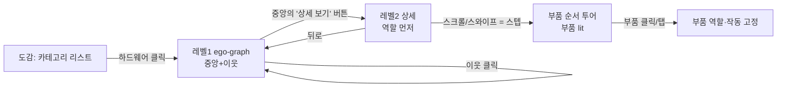
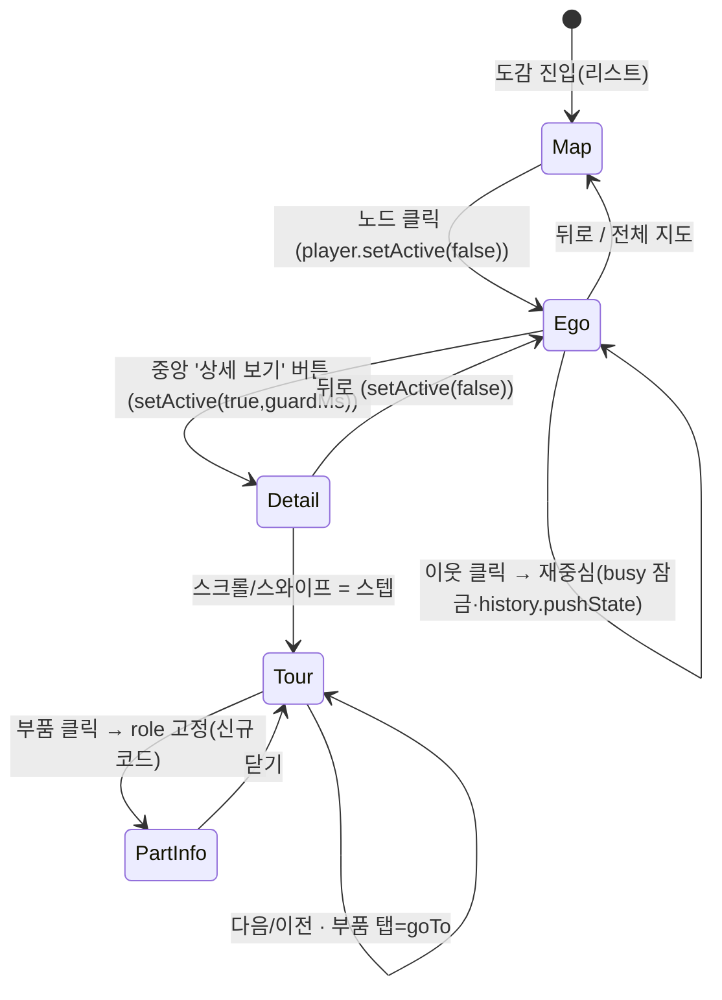

# 하드웨어 관계 그래프 뷰 — 언어 스택 · 아키텍처 설계

작성일 2026-08-27 · 범위: *설계* 문서(구현 전). 4관점 적대적 검증(성능·재사용정확성·UX/접근성·대안스택) 통과본.
대상 기능 = "도감에서 하드웨어 클릭 → 중앙 배치 → 이웃을 가장자리에 화살표·글로 → 이웃 클릭 시 재중심 애니메이션 → 중앙 하드웨어의 역할 설명 → 부품이 빛나고 스크롤/스와이프로 순서 설명 → 부품 클릭 시 역할·작동 설명".

관련 선행 문서: [스택 결정](stack-decision.md) · [설명 UX](explanation-ux.md) · [하드웨어 도감](hardware/README.md)

> **검증에서 바뀐 것(중요).** 초안은 "stage·player·components·kernel을 한 줄도 안 고치고 재사용"이라 적었으나, 4관점 검증이 코드로 이를 반증했다 — 레벨2(부품·재중심)에는 소폭 신규/추가가 **반드시** 필요하다. 또 성능 정당화를 JS 실행시간 수치로 닫았던 것을 "페인트(필터 재래스터) 측정 게이트"로 교체했다. **스택 결론(SVG·바닐라·무라이브러리)은 4관점 전원이 확인해 유지**하되, 아키텍처·비용·근거를 정직하게 정정한 것이 이 개정본이다.

---

## 0. 한 줄 결론

**스택은 현행 유지가 정답이다 — SVG(인라인 DOM) + CSS 상태전환 + 순수 JS + 자체 rAF 트윈(+ 기존 Rust/WASM 커널).** 새 렌더러·프레임워크·그래프 라이브러리는 넣지 않는다. 다만 **"기존 코드를 하나도 안 고치고 얹는다"는 아니다**: 카메라 수학(kernel)·CSS 상태 토큰(.lit/.dim/.xhi)·`Node` 시각은 그대로 쓰지만, **ego-graph 재배치·부품 하이라이트·플레이어 생명주기·입력 모드 중재**는 소폭 신규 코드/소폭 추가가 필요하다. 이 규모(정상상태 노드 ~12, 최악 ~18)에서 **JS 계산은 확실한 비병목**이지만, **페인트(필터 재래스터)는 미측정 위험**이라 1단계에 측정 게이트를 둔다. 렌더러를 고르는 것은 성능이 아니라 **요구(선명한 한글 라벨·접근성 트리·CSS 상태색·텍스트 선택)** 이며, 그 요구가 SVG를 강제한다.

---

## 1. 기능 분해 — 두 겹의 상호작용

요청은 **중첩된 두 레벨**이다.

### 레벨 1 — 그래프 내비게이션 (ego-graph)
- 21개 하드웨어 노드, 115개 관계 엣지(콘텐츠는 이미 검증됨: 완전 대칭, 정확히 115).
- 한 번에 **중앙 1개 + 그 이웃들**만(ego-graph).
- 이웃을 화면 가장자리에 방사형으로 **화살표 + 관계 이유(글)** 로 연결.
- 이웃 클릭 → 그 노드가 중앙으로 오도록 **재중심 애니메이션**.

### 레벨 2 — 하드웨어 상세 (부품 + 순서 투어)
- 중앙 하드웨어의 **역할(role)** 을 먼저 설명.
- **부품들이 빛난다**(`parts[]`).
- **스크롤/스와이프**(원 요청의 "드래그")로 기존 아키텍처 페이지처럼 **부품·작동을 순서대로** 설명.
- **부품 클릭** → 그 부품의 역할·작동(`parts[].role`) 상세.

> **용어 정정.** 원 요청의 "드래그"는 기존 `createPlayer`의 **스크롤/스와이프 스텝**으로 구현한다(포인터 down-move-up 핸들러는 기존 코드에 없다). 포인터 드래그를 문자 그대로 원하면 별도 제스처를 추가하되, **그래프 팬 드래그와 축·모드를 분리**해야 스텝 진행과 충돌하지 않는다.

---

## 2. 언어 스택 결정 (축별)

[stack-decision.md](stack-decision.md)와 동일 형식. **모든 축이 "현행 유지"로 수렴**. (기각 *근거*는 검증에서 정정했다.)

| 층 | 채택 | 탈락 후보와 **정정된** 기각 근거 |
|---|---|---|
| **렌더링** | **SVG(인라인 DOM) + CSS 상태전환** | Canvas/WebGL: 잃는 것은 "라벨 흐림"이 ~~아니라~~ **접근성 트리·텍스트 선택·`<g>` 클래스 기반 상태전환(.lit/.dim/.xhi가 붙을 DOM 소멸)·기존 kernel/stage 카메라와의 이중 관리**. 21노드에 GPU 가속이 필요할 부하도 아님. |
| **그래프 레이아웃 라이브러리** | **자체 방사형 배치** | cytoscape.js·vis-network: 리테인드모드라 라벨은 선명하지만, 자체 카메라가 **기존 kernel 카메라와 이중화**되고 **레벨2 부품 투어를 전혀 커버 못 함**, 200KB~1MB+상태색 DOM 부재. |
| **레이아웃 계산 모듈** | **삼각함수 방사형(결정적)** | d3-force(렌더러 아님, 좌표만, ~15–30KB, SVG와 결합 가능): 그럼에도 **비결정적 배치가 "카테고리 섹터 시계방향"이라는 결정적 교육 배치와 충돌**, N≤17에 물리 시뮬은 순수 오버헤드. dagre/elkjs: 계층정렬이 필요한 규모 아님. |
| **애니메이션** | **자체 rAF 트윈 + 기존 WASM 커널 재사용** | 재중심 카메라는 `kernel`이 로그줌·ease-out·거리비례로 이미 처리. GSAP/Motion: 빌드 or 84~140KB, 얻는 것 0. |
| **언어** | **순수 JS + `// @ts-check` 1줄**(신규 파일에) | TS 전환: 무빌드 파기, 대표 버그 미검출(스택 결정 실증). |
| **프레임워크** | **바닐라 유지** | React/Vue/Svelte: 상태가 "현재 중앙 id + 방문 스택 + 모드"뿐. |
| **데이터** | **정적 JSON `data/hardware-graph.json`** | 콘텐츠는 이미 보유(§4.1). 런타임 `fetch` 1회. |
| **빌드·배포** | **무빌드 · 상대경로** | 번들할 npm import 0건. |

---

## 3. 성능 — 정직한 판정 (JS는 비병목, 페인트는 미측정)

검증이 잡은 핵심: 초안이 인용한 실측치는 **전부 JS 실행시간**이고, 이 뷰의 실제 지배 비용은 **`filter: drop-shadow` 재래스터화**다(`.lit/.trail/.xhi` 모두 drop-shadow, `assets/style.css`; world transform이 매 프레임 `scale()`을 다시 써 필터 요소를 트윈 프레임마다 재래스터). 이는 stack-decision.md가 **"아직 아무도 측정하지 못했다"** 고 남긴 미해결질문 2 바로 그것이다.

| 구분 | 판정 | 근거/조치 |
|---|---|---|
| **JS 계산**(카메라 수학·펄스 전진·속성 쓰기) | **비병목(측정됨)** | 카메라 1스텝 0.4µs, setAttribute 0.93µs, 60fps 펄스 여유 733(JS)/5만+(WASM). ego-graph 엣지 펄스 ≤17은 예산 ~1%. |
| **페인트/필터 래스터** | **미측정(위험 잔존)** | 상세뷰 진입 시 CPU 부품 17개를 동시 `.lit`하면 기존 최대(동시 lit 7)의 **~2.4배 필터 요소**를 스케일 트윈 중 재래스터 → 검증 안 된 부하 영역. |
| **재중심 프레임** | **repaint-bound(모바일 미측정)** | 크로스페이드 순간 사라질/새 이웃이 DOM에 공존해 ~100 요소로 치솟고, 그 프레임이 카메라 트윈 최악 프레임과 겹침. (SVG는 HTML **리플로우가 아니라 repaint/re-raster** — 용어 주의.) |

**조치(설계에 반영):**
1. **측정 게이트** — 1단계 완료 기준에 "hub 노드(CPU/GPU) 진입·재중심을 Chrome·Safari DevTools Performance로 녹화해 filter raster가 프레임을 떨어뜨리는지 확인"을 명시(stack-decision 2단계 처방 상속).
2. **동시 글로우 상한** — 진입 시 전 부품 lit 대신 **현재 focus 부품만 글로우, 나머지는 정적 스트로크**(또는 순차 하이라이트). MVP "부품=라벨 목록"은 필터 부하 회피책도 겸함.
3. **재중심 직렬화** — exit→(제거 완료)→enter로 순간 DOM 수 억제, 또는 크로스페이드 중첩 창 축소.
4. **부하 기준은 평균 차수** — 2·115/21 ≈ **11**이 정상 부하(최악 17은 GPU·coproc 둘뿐). 라벨 밀도·반경·폴백을 **차수에 따라 적응**.
5. `prefers-reduced-motion`은 **성능 완화책이 아니다**(RM 사용자에게만 적용). 기본 사용자 페인트 부하는 위 1~3으로 관리.

> 결론은 그대로다: 이 규모에 Canvas/WebGL/그래프 라이브러리는 순손해다. 다만 그 정당화는 "JS가 한가하다"가 아니라 **"요구가 SVG를 강제하고, 페인트 위험은 측정으로 게이트한다"** 이다.

---

## 4. 아키텍처 설계

### 4.1 데이터 모델 & 원천 (정직하게)

목표 산출: `data/hardware-graph.json` = `{ nodes:[{id,name,category,one_line,role,parts[],how_it_works[],concepts}], edges:[{a,b,reason_ab,reason_ba}] }`.

**현 상태(검증 결과):** 관계·부품·역할·작동 **콘텐츠는 존재하고 신뢰 가능**하다 — `docs/hardware/*.md`의 연관 테이블이 **완전 대칭·정확히 115엣지**로 검증됐다. 그러나 이를 만든 **생성기·`research_merged.json`은 세션 스크래치패드에만 있고 저장소 `tools/`는 비어 있다**(작업 트리에 미커밋). 따라서 "생성기에 10줄 emit"은 *현재 저장소에 없는 파이프라인*을 전제한다.

**원천 확정 — 둘 중 하나:**
- **(A) 생성기 커밋**: 스크래치패드의 생성 스크립트 + `research_merged.json`을 `tools/`로 커밋하고 `hardware-graph.json` emit 블록을 추가. 단일 원천이 문서·그래프에 공유.
- **(B) md 파싱 폴백**: `docs/hardware/*.md`의 `## 🔌 연관 하드웨어`·`## 🧩 주요 부품`·역할 섹션을 파싱해 JSON 생성. `reason_ab`/`reason_ba`는 **두 문서에 나뉘어 있으므로**(예: cpu.md엔 cpu→dram, dram.md엔 dram→cpu) **양방향을 조인·중복제거**하는 단계가 필수 — 이 조인 때문에 "10줄"이 아니라 수십 줄이다.

권장: **(A)** — 콘텐츠 원천이 이미 구조화 데이터라 파싱보다 안전하다.

### 4.2 모듈 구성 & 재사용 정밀 지도

```mermaid
flowchart TB
  HTML[hardware.html ★신규<br/>도감 셸] --> GRAPH[lib/graph.js ★신규<br/>ego 노드·엣지 생명주기·재중심·입력라우터]
  GRAPH -->|카메라 수학| KERNEL[lib/kernel.js ♻무수정<br/>로그줌·ease-out·펄스]
  GRAPH -->|시각| NODEVIS[components.js Node ♻무수정<br/>그래프 노드 박스]
  GRAPH --> DETAIL[lib/hw-detail.js ★신규<br/>부품=comp 구성·부품클릭]
  DETAIL --> STAGE[lib/stage.js ⚠소폭추가<br/>부품 comp 등록·remove/clear]
  DETAIL --> PLAYER[lib/player.js ⚠소폭추가<br/>destroy·setSteps]
  GRAPH --> DATA[(data/hardware-graph.json ★신규)]
```

**재사용 진실표(검증 반영):**

| 자산 | 레벨1 그래프 | 레벨2 상세 | 판정 |
|---|---|---|---|
| `kernel.js`(카메라·펄스 수학) | 무수정 | 무수정 | ✅ 그대로 |
| CSS 토큰 `.lit/.dim/.xhi`, `--ease` | 무수정 | 무수정 | ✅ 그대로 |
| `components.js` `Node()` | 무수정(노드 박스) | — | ✅ 그대로 |
| `components.js` 하드웨어 팩토리(CPU 등) | — | ⚠ **부품을 `data-part <g>`로 노출하도록 개조** 또는 부품을 개별 comp로 등록 | 개조/우회 필요 |
| `stage.js` `tweenTo/fit`(카메라) | 재사용 | 재사용 | ✅ 단, 아래 단서 |
| `stage.js` 노드/트레이스 **재배치·제거** | ❌ **API 부재** (add·decorate만, remove/clear 없음; `kernel.registerPath` 해제 없음) | — | ⚠ **stage에 remove/clear 추가** 또는 graph.js가 자체 관리 |
| `stage.js` `setStates/fit`(부품 대상) | — | ⚠ `comps`(최상위 id) 전용 → **부품을 comp로 등록해야** 동작 | 등록 필요 |
| `player.js` fold 스텝·입력통제 | — | ⚠ **`destroy()`·`setSteps()` 없음** → 재중심마다 새로 만들면 리스너 누수·busy 충돌 | 소폭 추가 |
| `player.js` `setActive/onExitTop` 핸드오프 | ✅ 모드 중재에 재사용 | ✅ | ✅ 그대로 |

### 4.3 레벨 1 — ego-graph 레이아웃 & 재중심 (모델 확정)

- **재중심 모델을 하나로 못박는다**: stage의 컴포넌트는 생성 시 절대좌표가 baked-in이고 stage엔 노드 재배치/제거 API가 없다. 따라서 **graph.js가 ego 노드·엣지 `<g>`의 생성/좌표/제거를 직접 관리**한다(카메라 수학만 kernel 재사용). 재중심 = ①새 ego 집합 좌표 계산 → ②구 노드/엣지 페이드아웃·**DOM 제거** → ③신 노드/엣지 생성·페이드인 → ④카메라를 **ego 집합 전체**에 맞춤(`fit([center,...neighbors])` — 단일 노드 fit은 maxS=2.4로 이웃이 화면 밖으로 나가므로 금지).
  - 엣지에 펄스를 흘리려면 `trace()`가 `kernel.registerPath`로 경로를 등록하는데 **해제 API가 없어 재중심 반복 시 커널에 경로가 누적**된다 → stage에 `removeTrace(id)`(+커널 경로 해제) 또는 graph.js가 펄스를 자체 rAF로 처리. **MVP는 그래프 엣지에 펄스를 넣지 않고**(정적 화살표) 상세뷰에서만 펄스 사용해 이 문제를 회피.
- **입력 동시성 가드**: 빠른 연속 이웃 클릭 시 `tweenTo` 재호출이 트윈을 겹쳐 튀게 한다(stage엔 busy 잠금이 없음 — `player.goTo`에만 있음). graph.js에 **재중심 busy 잠금**(트윈 완료 전 입력 무시)을 둔다.
- **배치 규칙(적응형)**:
  - 카테고리는 데이터상 **6개**(연산·메모리·저장장치·기판·버스·전원·입출력·네트워크). 이웃을 카테고리 **섹터**로 묶어 시계방향 배치, 섹터 각도는 **이웃 수 비례 + 최소 각도 하한**(한 섹터 과밀 방지).
  - 라벨 겹침: `base()`의 "박스 아래 고정" 라벨은 3·9시에서 세로로 겹친다 → graph.js는 **방위각에 따라 text-anchor/dy 회전**(위=위, 좌=오른쪽 정렬 등) + **방위별 가변 반경(타원 배치)**.
  - 엣지 라벨(관계 이유): 17이웃에 문장형 공존 불가 → **항상 보이는 것은 화살표+카테고리색+동사 뱃지(직결/DMA/급전…)**, **전문은 hover(데스크톱)/탭(모바일)**. **저차수 노드(≤8이웃: SRAM·HDD·SPI·display·input·camera·infra 등 다수)는 전문 라벨 기본 노출** — "글로 보이는" 경험을 절반 이상 노드에서 보장.
- **브라우저 히스토리**: 각 재중심을 `history.pushState(?hw=<id>)`로 반영 → **Back 버튼 = 재중심 취소**(페이지 이탈이 아니라). 딥링크 `?hw=cpu`가 초기 중앙.

> ⚠️ **교육적 구분(유지).** 시나리오 다이어그램은 "실제 물리 배치"라 손배치가 학습 내용(stack-decision). **이 관계 그래프는 추상 관계도**라 계산 방사형이 정확·오해 없음. 두 뷰를 혼동 말 것.

### 4.4 레벨 2 — 부품 하이라이트 · 순서 투어 · 부품 클릭

**핵심 결정 — 부품을 어떻게 다루나(트레이드오프):**

- **(권장) 부품 = 1급 comp 등록.** 중앙 하드웨어를 그릴 때 각 부품을 `stage.add('cpu.alu', …)`처럼 개별 등록하면 **`setStates({lit:['cpu.alu']})`·`fit(['cpu.alu'])`·xhi가 부품 id로 그대로 동작**한다. 즉 **상세뷰 = 부품을 comp로 하는 미니 시나리오**. 부품 좌표는 자동 배치(그리드/방사형 라벨 박스)로 시작.
  - 대가: "하나의 하드웨어 팩토리 blob"이 아니라 부품 단위 조립이 됨. 정밀 도형은 팩토리에 `data-part <g>` 노출을 추가(3단계).
- **(대안) 팩토리 개조.** 각 부품을 `el('g',{'data-part':...})`로 래핑하고 별도 하이라이트 코드 작성. `setStates`는 못 쓰고 신규 코드 필요.

**반드시 정정할 점(초안 오류):**
- 부품 id를 `st.lit`/`st.focus`에 그냥 넣으면 **안 된다** — 미등록 id면 `setStates`가 경고 후 **화면 전체를 dim**(stack-decision이 실증한 버그), `fit`은 카메라를 **월드 중앙으로 리셋**. 부품을 comp로 등록(권장)하거나, `st.run` 훅(미수정 재사용 가능)에서 처리하고 `st.lit/st.focus`는 비운다.
- **부품 클릭=역할 고정은 신규 코드**다. 기존 `wireCrossHighlight`는 **hover 전용·comp 단위**라 그대로는 못 쓴다. 재사용되는 것은 **`.xhi` CSS 토큰뿐**.
- **플레이어 생명주기**: `createPlayer`는 window에 리스너 5개를 걸고 `destroy()`·`setSteps()`가 없다. 하드웨어를 옮겨다니며 상세 player를 매번 새로 만들면 리스너가 쌓여(10이동=50개) 모든 이전 player가 동시 발화한다. → **`player.js`에 `destroy()`(리스너 해제)+`setSteps()`(스텝 교체) 소폭 추가**, 또는 상주 player 하나를 재구성. 어느 쪽이든 `player.js`는 손대야 한다("무수정" 철회).
- **공간적 근접성(explanation-ux 1순위 레버 d≈1.10)**: 역할·부품 설명을 "좌측 패널"로만 두면 split-attention 재도입. → **역할 리드 1줄·부품 role은 도형 옆 콜아웃**(`stage.trace(..,{label,at})` 기제 재사용)을 대표안으로, 긴 심화만 패널.

### 4.5 입력 소유권 — 모드 상태기계 (검증이 가장 강조)

`createPlayer`는 window의 wheel·화살표·space·PageUp/Down·Home/End를 `preventDefault`로 **독점**한다. 설계가 같은 키/스크롤을 ego 이웃 순회와 스텝에 이중 배정하므로 **모드 중재자가 없으면 정면충돌**한다.

- **모드 enum**: `ego`(레벨1) / `detail`(레벨2). **활성 모드만 입력 소유**.
- **이미 있는 해법 재사용**: `player.setActive(false)`/`enabled:false` + `onExitTop` 핸드오프가 "스크럽↔스텝" 소유권 이전을 정확히 이 목적으로 한다.
  - ego 모드: `player.setActive(false)` — 화살표/스크롤은 graph.js의 이웃 순회 핸들러가 배타 처리.
  - detail 진입: `player.setActive(true, guardMs)` — **guardMs를 관성 간격(MOMENTUM_GAP=120)보다 길게** 걸어 첫 관성 휠을 흡수(과거 "리빌→투어 0→1 튐" 버그 방지).
- **detail 진입 트리거는 스크롤이 아니라 명시적 클릭/버튼**으로 좁힌다(스크롤 진입은 우발 진입·관성 버그를 부름).
- **클릭 의미 분리**: 이웃 클릭=재중심 / 중앙의 **'상세 보기' 버튼**=detail 진입. 같은 시각 객체 연속 클릭이 서로 다른 동작이 되는 혼란 제거. 중앙 노드는 테두리·힌트로 시각 차별화.

### 4.6 접근성 (신규 투자 — 처음부터)

그래프는 접근성 최취약 UI이고 저장소에 전례가 없다(`:focus` 0개·`aria-live` 0개, stack-decision 실측).

- **셸의 `<svg role="img">`를 쓰지 않는다** — role=img는 SVG 하위 전체를 "하나의 이미지"로 원자화해 내부 노드(role=button·라벨)를 AT에서 감춘다. 대신 컨테이너를 `role="application"`/`group`, 각 노드 `<g>`를 focusable(`tabindex`, `role="button"`, `aria-label="CPU, 이웃으로 이동"`)로. 또는 **SVG 위에 실제 `<button>` 오버레이 레이어**를 얹어 포커스·클릭 담당.
- **키보드 내비**: 화살표키로 이웃 순회(ego)·스텝 이동(detail)을 **모드별 배타** 처리. Enter=재중심/부품 열기.
- **`aria-live` 리전은 SVG 밖 별도 요소**로: 재중심 시 "중앙: CPU, 이웃 16개", 스텝 전환 시 스텝 제목 안내.
- **모바일**: 부품 라벨 **직접 탭 → `goTo(idx)` 점프**(기존 items click→goTo 존재)를 1차 경로로 — 매번 스와이프하는 마찰 제거.

### 4.7 애니메이션 · 모바일 · 모션

- 재중심=카메라 트윈(kernel, 로그줌·ease-out·거리비례) + 노드/부품 페이드=CSS 트랜지션(`--ease`). **크로스페이드 직렬화**로 페인트 순간부하 억제(§3).
- `prefers-reduced-motion`: 재중심·펄스·글로우 즉시 스냅(기존 `RM` 경로). **단 성능 완화책 아님**(§3-5).
- 모바일: 17이웃 방사형이 안 들어오면 **반원/리스트 폴백**, 이웃 탭=엣지 라벨 펼침(1차)→재탭/라벨 내 화살표=재중심(2차)의 2단 탭.

---

## 5. 구현 단계 (MVP → 확장) — 정직한 비용

| 단계 | 내용 | 신규/추가 | 리스크·게이트 |
|---|---|---|---|
| **0. 데이터** | `hardware-graph.json` 산출 — 생성기 커밋(A) 또는 md 파싱+양방향 조인(B) | 생성기/파서 (수십 줄, "10줄" 아님) | 원천 확정 |
| **1. MVP 그래프** | `hardware.html`+`graph.js`: 방사형 ego(적응형 라벨), 화살표+동사뱃지, 클릭 재중심(자체 노드 생명주기+카메라 fit+busy 잠금+history), 역할 콜아웃, 리스트 진입 | graph.js(수백 줄 — 라벨충돌·모바일·a11y 포함), stage `remove/clear` 소폭 | **페인트 측정 게이트**(hub 진입/재중심 DevTools 녹화) |
| **2. 상세 모드** | `hw-detail.js`: **부품=comp 등록** + `player` 드래그 투어(how_it_works 스텝) + 부품 클릭 role 고정 | hw-detail.js, `player.destroy()/setSteps()` 추가, 부품 클릭 신규 코드 | 동시 글로우 상한, 입력 모드 중재 |
| **3. 정밀·다듬기** | 부품별 정밀 SVG(팩토리 `data-part` 확충 20~25개≈350~400줄), 엣지 라벨 밀도, 전체맵 뷰, 모바일 폴백 | 팩토리 확충 | 저작량 |

**MVP 우회로**: 2단계에서 부품 정밀 도형이 부담이면 부품을 **라벨 박스 목록(comp 등록)** 으로 먼저 — 기능(lit·클릭·투어)은 완성되고 필터 부하도 준다. 정밀 도형은 3단계.

---

## 6. 대안 고려 및 기각 (정정된 근거)

| 후보 | 기각 근거(정정) |
|---|---|
| **React/Vue/Svelte** | 상태가 "중앙 id+방문 스택+모드"뿐. 무빌드 파기. |
| **Canvas 2D / WebGL / PixiJS** | 잃는 것: **접근성 트리·텍스트 선택·`.lit/.dim/.xhi` DOM 상태전환·기존 kernel/stage 카메라와 이중 관리**. (초안의 "라벨 흐림"은 부정확 — 리테인드모드는 배율마다 재래스터해 선명.) |
| **cytoscape.js / vis-network** | 자체 카메라가 kernel과 이중화, **레벨2 부품 투어 미커버**, 상태색 DOM 부재, 200KB~1MB. |
| **d3-force** | 렌더러 아님(좌표만, ~15–30KB, SVG 결합 가능)이지만 **비결정적 배치가 카테고리 섹터 결정 배치와 충돌**, N≤17에 물리 시뮬은 순수 오버헤드. |
| **dagre/elkjs** | 계층정렬이 필요한 규모 아님. |
| **Rust/WASM로 레이아웃 이관** | 21노드 배치는 JS로 <0.1ms. 경계 비용이 이득 초과(카메라 1스텝이 JS가 더 빠른 것과 동일 논리). |

> **라이브러리가 실제로 이기는 유일 조건**: "115엣지 전체맵 자동배치". MVP는 이를 회피 중이므로, 채택 트리거를 stack-decision식 숫자로 고정 — *"전체맵을 도입하고, 손 배치한 방사형이 실제로 겹쳐 못 읽을 때"* 만 cytoscape 재검토.

---

## 7. 리스크 · 미해결 질문 (개정)

1. **페인트(필터 재래스터)** — 미측정. 1단계 측정 게이트 통과가 선결. 실패 시: 글로우를 `box-shadow`가 아닌 저비용 표현(테두리·밝기)으로, 동시 글로우 상한.
2. **부품 정밀 도형 저작량** — 팩토리 20~25개(≈350~400줄, stack-decision 미해결질문 3). MVP는 라벨 박스로 우회.
3. **stage/player 소폭 추가의 회귀 위험** — `remove/clear`(stage)·`destroy/setSteps`(player)는 기존 4개 시나리오에 영향 없어야 함(추가만, 시그니처 불변). `tools/check.mjs`류로 회귀 확인.
4. **엣지 라벨 밀도** — 허브(17)에서 전문 라벨은 상호작용 뒤로. 저차수(다수)는 기본 노출. 트레이드오프를 명시적으로 수용.
5. **모바일 방사형** — 좁은 화면 폴백(반원/리스트) 필요.
6. **you-are-here / 길잃음** — 재중심 연쇄에서 방향 단서가 "중앙 라벨+뒤로"뿐. **브레드크럼(cpu › dram › ssd)** 또는 미니맵 추가(MVP는 브레드크럼 한 줄). 깊이 5단계를 시각적으로 평탄화.
7. **데이터 파이프라인 미커밋** — 생성기·`research_merged.json`이 저장소에 없음. §4.1 (A) 커밋 권장.

---

## 8. 요약 — 무엇을 결정했나

- **언어/스택**: 현행(SVG·CSS·순수 JS·자체 rAF·무빌드·WASM 커널) 유지. **새 의존성 0.** (4관점 전원 확인.)
- **성능**: JS는 비병목(측정됨), **페인트는 미측정 → 1단계 측정 게이트**. 요구(라벨·접근성·상태색)가 SVG를 강제.
- **재사용(정직)**: `kernel`·CSS 토큰·`Node` 시각은 무수정. **`stage`(remove/clear)·`player`(destroy/setSteps)는 소폭 추가**, ego 재배치·부품 하이라이트·부품 클릭·입력 모드 중재는 신규. "한 줄도 안 고침"은 철회.
- **레벨2 핵심**: **부품을 1급 comp로 등록**하면 `setStates/fit/xhi`가 부품 단위로 그대로 동작(미니 시나리오 패턴).
- **입력**: `ego`/`detail` 모드 enum + 기존 `setActive` 핸드오프로 소유권 중재.
- **접근성**: `role=img` 회피, 노드 focusable, `aria-live` SVG 밖, history 연동 — 처음부터.
- **데이터**: 콘텐츠 보유·검증됨(115엣지 대칭). 파이프라인은 커밋 필요.
- **구현 순서**: 데이터 emit → MVP ego(+측정 게이트) → 상세(부품=comp, player 추가) → 정밀 도형.

> 다음 단계 후보: (a) §4.1 (A) 데이터 파이프라인 커밋 + `hardware-graph.json` 산출, (b) hub 노드(CPU) 방사형 좌표를 실제로 스케치해 라벨 충돌·페인트를 눈·프로파일러로 검증, (c) `stage.remove/clear`·`player.destroy/setSteps` 소폭 추가의 시그니처 초안.

---

### 부록 — 검증 provenance

4관점 적대적 검증(성능·재사용정확성·UX/접근성·대안스택, 에이전트 4개, 오류 0). **전원이 스택 결론을 확인**하고, 다음을 코드 근거로 정정: 재사용 과장(레벨2 3개 모듈 개조 필요), 성능 정당화(JS수치→페인트 게이트), 입력 모드 중재 부재, `role=img` a11y 함정, 대안 기각 근거 2건 오류(라벨흐림·d3-force), 비용 3건 과소(40~60줄·0줄 재사용·10줄 emit), 데이터 파이프라인 미커밋, 공간 근접성 위반, you-are-here 부재, 클릭 의미 이중.
