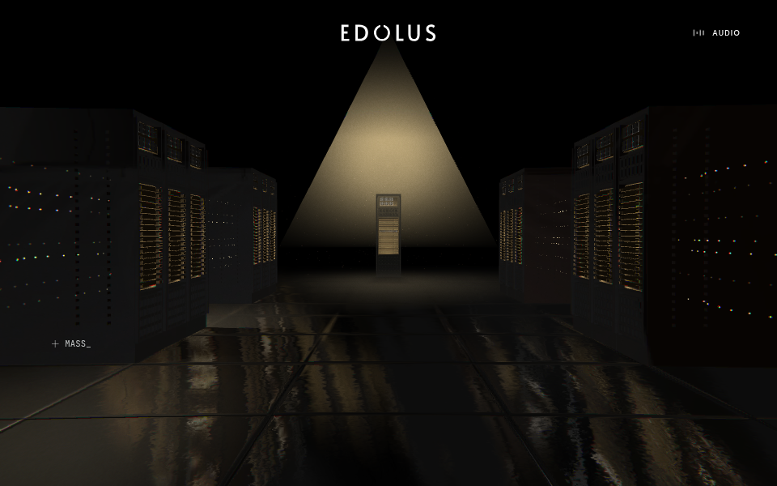
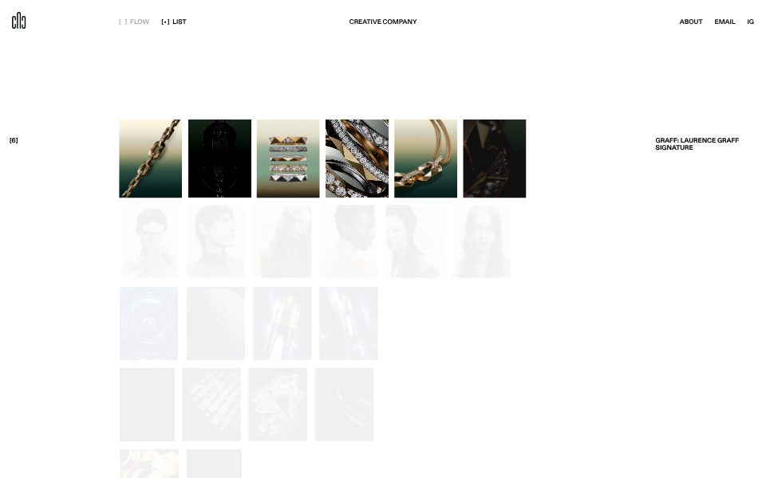
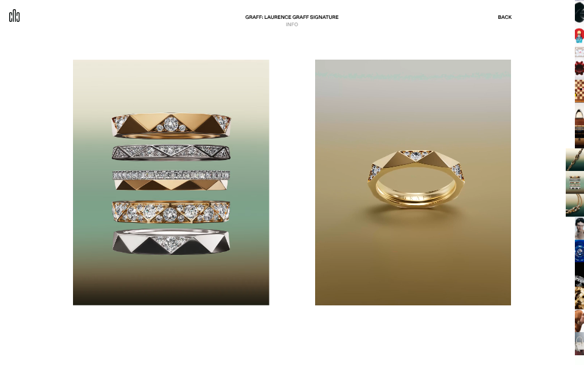

# 레퍼런스 관찰 기록

2026-10-07 · [설계안으로](README.md)

**적용 방향 갱신:** 아래는 참고 사이트 자체의 관찰 기록이다. 현재 시안에는 로고·내비게이션·오른쪽 썸네일·설명 패널을 적용하지 않는다. 최신 구현 기준은 [설계안](README.md)을 따른다.

대상: [EDOLUS](https://edolus.com/) / [Cactus Digitale](https://cactusdigitale.com/?ref=siteinspire)

## 확인 방법과 범위

첫 화면의 정지 이미지로만 판단하지 않았다. 브라우저에서 진입, 휠 스크롤, 포인터 이동, FLOW / LIST 전환, 상세 진입·복귀, INFO 열기·닫기, About 전개를 확인했다. EDOLUS는 마지막 제작 스튜디오 안내까지 확인했다.

- 데스크톱: 1440×1000 및 1280×800 CSS px. 후자의 일부 캡처는 DPR 0.75.
- 모바일: 390×844, 터치 에뮬레이션. EDOLUS의 진입 및 연속 스와이프에 따른 진행을 확인했고, Cactus의 상세·INFO·LIST를 확인했다.
- WebGL은 Chromium 소프트웨어 렌더러였다. **실제 기기의 프레임 속도·로딩 시간·촉감은 측정하지 않았다.** 이를 원본 사이트 성능 평가로 사용하지 않는다.
- EDOLUS의 장면별 대표 구도를 놓치지 않기 위해 실제 휠 탐색과 원본 내부 타임라인의 진행도 지정 캡처를 병행했다. 0.205 / 0.44 / 0.52 / 0.56 / 0.64 / 0.78 / 0.92 / 1.0을 살폈다. 진행도 직접 지정은 스크롤 동작 자체의 테스트와 구별한다.
- 미세한 이징·시간은 눈으로 추정해서 확정하지 않았다. 브라우저에 공개된 장면 설정과 전환 코드를 읽어 교차 확인했다.
- 스크린샷은 움직이는 장면의 한 프레임이다. EDOLUS의 글자 섞임·블러가 남아 있는 프레임을 최종 정지 레이아웃으로 해석하지 않는다.
- 저장한 원본 화면은 디자인 검토 근거다. CAwiki 서비스의 이미지·영상·텍스처로 사용하지 않는다. 원본 스크립트는 저장소에 포함하지 않았다.

## 1. EDOLUS — 전체 화면 안에서 크기와 공간을 바꾸는 서사

### 실제 장면 구조

공개된 `SceneManager.SEGMENTS`와 실제 화면을 대조했다. 아래 범위는 **원본의 정규화된 진행도**다. 휠 이동량은 구간별 가중치 때문에 같은 비율이 아니다.

| 원본 구간 | 화면에서 확인한 구성 | 전환에서 볼 것 | 근거 |
|---|---|---|---|
| 진입 | 로고·짧은 소개·진입 CTA, 지구 배경, 오디오 안내 | 콘텐츠 진입이 별도 사건으로 느껴짐 | [모바일 진입](references/edolus-entry-mobile.png) |
| 0–0.14 / Satellite | 화면을 채우는 지구의 곡률, 위성이 접근하고 회전, 큰 제목과 작은 라벨 | 근경과 원경, 오브젝트 일부 크롭, 대상과 함께 움직이는 시점 | [궤도](references/edolus-orbit.png) |
| 0.14–0.28 / Diamond map | 지형과 도시 지도, 화면 위 프레임·좌표 같은 시각 언어 | 우주 규모에서 지표면 규모로 이동 | [지도](references/edolus-map.png) |
| 0.28–0.54 / Datacenter | 랙 사이의 통로 → 특정 연산 보드 → 가까운 칩 | 공간 전체 → 제품 → 내부 요소로 연속 접근 | [통로](references/edolus-datacenter.png), [보드](references/edolus-compute-board.png), [칩](references/edolus-chip.png) |
| 0.54–0.57 / Chip | 빛과 입자 속 작은 중심 구조 | 매우 짧은 진행 구간이지만 속도·크기가 급격히 바뀜 | 원본 타임라인과 0.56 프레임 확인 |
| 0.57–0.71 / UI | 중앙의 시각 요소가 가로 방향 카드 배열로 연결 | 3D 오브젝트에서 인터페이스 배열로 매체가 이어짐 | [인터페이스](references/edolus-interface.png) |
| 0.71–0.85 / Car | 밝은 공간, 자동차, 배경 풍경, 이동을 나타내는 빛 | 어두운 추상 공간에서 실세계 맥락으로 분위기 전환 | [자동차](references/edolus-car.png) |
| 0.85–1 / Ending | 자동차 뒤로 검은 띠가 닫히고, 문장·제작 스튜디오·재시작 안내 | 장면을 닫고 다음 행동으로 수렴 | [마지막 화면](references/edolus-ending.png) |

### 화면 배치에서 추출한 원칙

- 무대가 전체 화면이다. 텍스트와 오브젝트를 늘 고정된 2열 박스에 넣지 않는다.
- 중앙 상단 로고는 장면이 바뀌어도 기준점이 된다. 오디오처럼 부가 조작은 가장자리로 밀려 있다.
- 제목은 오브젝트의 빈 공간에 크게, 기술적 보조 설명은 작게 배치한다.
- 시점 이동, 부분 크롭, 반사, 대기 효과로 깊이를 만든다. 대상 자체의 이동도 함께 사용한다.
- 시각적 전환에 기능이 있다. 규모를 바꾸거나, 다음 이야기의 대상에 시선을 옮긴다.

### 코드·설정에서 교차 확인한 동작

출처: 원본 [런타임 설정](https://edolus.com/__settings__.js), [공개 장면 설정](https://edolus.com/2509662.json), [브라우저 스크립트](https://edolus.com/__game-scripts.js).

| 항목 | 원본에서 확인한 값·구조 | 설계상 의미 |
|---|---|---|
| 렌더링 | PlayCanvas 기반 장면 | 오브젝트·카메라가 실제 3D 공간에서 연속 변화 |
| 스크롤 입력 | 데스크톱 기준 `totalScrollPx: 32000`, 터치 `4000` | 모바일 입력 거리를 별도로 설계 |
| 진입 게이트 | `introScrollPx: 1200`; 최초 오브젝트 진입 동안 타임라인을 붙잡음 | 시작 모션과 본문 스크롤의 역할 구분 |
| 읽기 구간 | UI·칩·자동차·위성·지도에 서로 다른 stretch factor | 중요한 대상 앞에서 더 오래 머무는 스크롤 배분 |
| 정지 위치 | snap 지점 0.06 / 0.145 / 0.205 / 0.44 / 0.52 / 0.61 / 1 등; idle delay 1초 | 멈추면 의도된 구도로 정착 |
| 카메라 | 기본 전환 1.2초, `power2.inOut`; 포인터 시차는 특정 구간에만 적용 | 모든 장면을 무조건 흔들지 않음 |
| 모바일 | 768px 분기, 위성 포즈의 별도 위치 값 | 세로 화면용 재구도 필요 |
| 엔딩 | 약 0.83부터 엔딩 밴드 등장, 1에서 정리 | 마지막 장면과 엔딩 전환은 범위가 겹침 |

값은 원본 설정에서 읽은 것이며 브라우저에서 실제로 소요된 시간을 실측한 수치가 아니다. 전체 원본의 타이밍을 CAwiki에 그대로 가져오는 것도 아니다.

### 모바일 확인

진입 화면에서는 큰 제목이 세 줄로 재배치된다. CTA 좌표 클릭 후 진입을 확인했고, 터치 이벤트 연속 입력으로 지도 구간까지 이동했다. [세로 화면의 지도](references/edolus-mobile.png)는 가로 프레임을 그대로 축소하지 않고 중앙 대상을 세로 구도로 담는다.

### CAwiki에 적용할 것

**매크로 부품 → 주변 부품 → 시스템 → 작동 경로**의 규모 변화. 같은 오브젝트를 다음 장면의 연결점으로 유지한다. 설명 구간의 스크롤 길이를 따로 준다.

원본의 장시간 진입 연출, 영문 글자 섞임, 강한 색수차·블러, 오디오 의존은 학습 목적에 맞게 조절한다. 특히 한국어 본문에는 문자 섞임 효과를 적용하지 않는다.

## 2. Cactus Digitale — 공간, 전시, 색인, 개별 매체의 네 단계

### 홈

홈은 흰 배경 위에 단순한 정적 이미지 격자를 올려 둔 화면이 아니다. 이미지와 영상이 크기·깊이·위치를 달리하며 공간에 나타나고 사라진다. 가장자리의 흐림·백색 페이드와 부분 크롭이 공간의 경계를 만든다. 포인터 위치를 바꿔 여러 구도를 확인했으며, 홈에서 미디어 영역을 클릭하면 `/projects`로 이동했다. 홈에서 휠 입력만 한 검토에서는 URL이 `/`에 남았다.

제작 설명에서 부르는 “공간 큐브”와 관찰한 깊이 표현이 일치한다. 보조 출처: [제작 소개](https://www.csslight.com/website/72485/Cactus-Digitale). 분석의 주 근거는 실제 화면과 원본 코드다.

[홈 공간](references/cactus-space.png)

### 프로젝트 탐색: FLOW와 LIST

| 상태 | 관찰한 배치·행동 | CAwiki 해석 |
|---|---|---|
| FLOW 상단 | 큰 중앙 매체, 좌우에 다음 매체가 일부 보임. 캡션은 화면 가장자리 | 한 부품을 크게 보여 주되 다음 대상의 존재도 암시 |
| FLOW 아래 | 화면을 크게 쓰는 이미지와 서로 다른 크기·비율의 매체 배열 | 동일한 카드의 반복보다 크기와 간격으로 리듬 형성 |
| LIST | 프로젝트별 여러 썸네일을 한 행으로 묶은 이미지 색인 | 역할별·부품별 축소 배열로 구조를 한눈에 확인 |
| LIST 호버 | 해당 행이 남고 다른 행은 흐려짐. 바깥쪽에 제목과 개수 표시 | 선택한 부품과 연결된 영역만 강조 |
| 상세 진입 | URL이 프로젝트별 주소로 바뀌며 별도 상세 셸로 전환 | 부품·시나리오에 고유 진입 주소 제공 |
| 복귀 | BACK으로 `/projects` 복귀. 검토 경로에서는 LIST 선택 유지 | 사용자가 보던 모드와 위치를 잃지 않게 설계 |

### 개별 프로젝트 상세

실제 검토 경로: [Graff 프로젝트](https://cactusdigitale.com/projects/graff-laurence-graff-signature).

- **상단 중앙**에 프로젝트 제목과 INFO. 로고는 왼쪽, BACK은 오른쪽.
- 데스크톱에서는 **두 개의 큰 매체를 나란히** 놓고 넓은 여백을 준다. 이미지와 동영상이 함께 쓰인다.
- 오른쪽에 **아주 얇은 세로 썸네일 띠**가 보인다. 다른 매체·프로젝트의 존재를 계속 드러낸다.
- 아래쪽으로 이동하며 다른 매체와 이전·다음 프로젝트 문맥을 만난다.
- INFO는 옆에 붙는 고정 설명 패널이 아니다. **전체 화면에 반투명·블러 레이어가 열리고 중앙에 설명**이 놓인다.
- CLOSE로 닫으면 보고 있던 매체로 돌아간다.
- 사이트 공통 ABOUT은 이 INFO와 다르다. 위에서 정보 영역이 펼쳐지며 기존 콘텐츠를 아래로 밀어낸다.

[INFO 오버레이](references/cactus-info.png) · [ABOUT 전개](references/cactus-about.png)

### 공개 전환 코드에서 확인한 것

출처: 원본 페이지가 불러오는 [전환 모듈](https://cactusdigitale.com/_next/static/chunks/dadc0a78f3aa93a5.js).

| 전환 | 선언된 형태 | 선언된 시간 |
|---|---|---|
| 기본 | quint 계열 ease-out | 0.7초 |
| 홈 → 프로젝트 목록 | 나가는 화면 축소·페이드; scale 목표 0.96 | scale 35/60초, opacity 20/60초 |
| 목록 → 프로젝트 | 들어오는 화면 scale 0.98 → 1, opacity 0 → 1 | 0.35초 + 0.1초 delay |
| 프로젝트 → 목록 | 나가는 화면 페이드, 목록 페이드 복귀 | exit 0.15초, enter 0.25초 + 0.1초 delay |
| 프로젝트 → 다음 프로젝트 | 전체 화면이 세로 방향으로 이동 | 1.2초; 들어오는 화면 delay 0.08초 |
| 역방향 프로젝트 | 위·아래 이동 방향 반전 | 같은 전환 계열 |

이는 전환 정의의 값이다. 모든 콘텐츠가 그 시간 내에 로드된다는 뜻이 아니다. 초기 진입·매체 로딩·애니메이션의 중간 상태를 최종 화면과 구분해서 관찰했다.

### 모바일

[상세 모바일](references/cactus-mobile-detail.png)에서는 큰 매체 두 개가 **위아래로 쌓인다**. 상단에는 제목·INFO가 남고 BACK 대신 닫기 모양의 조작이 나타난다. 하단에 현재 매체 위치가 표시된다.

[LIST 모바일](references/cactus-mobile-index.png)은 큰 공백과 축소 썸네일의 행 구조를 유지한다. CAwiki에서는 작은 썸네일만으로 부품을 식별하게 하지 않고 이름·역할을 보완한다. 화면 가장자리에 걸리는 항목은 터치 탐색이 명확하도록 조정한다.

### 예상하지 못했던 상태도 확인

오래 조작하지 않은 상태에서는 `IdleOverlay`가 올라와 다른 조작을 가렸다. 클릭으로 돌아온 뒤 탐색을 이어갔다. CAwiki의 학습 화면에는 이 동작을 가져오지 않는다. 사용자가 설명을 오래 읽는 것이 유휴 상태일 수 있기 때문이다.

## 3. 레퍼런스에서 설계로 옮기는 연결표

| 실제 참조 요소 | 적용 화면 | 구체적인 변환 | 유지하지 않을 부분 |
|---|---|---|---|
| EDOLUS 전체 화면 공간 | 메인 | CPU 근접 → 컴퓨터 전개 → 데이터 경로 | 기존 설명 패널 중심 구도 |
| EDOLUS 랙 → 보드 → 칩 | 메인·상세 연결 | 전체와 부분의 크기 연속성 | 위성·차량 같은 원본 소재 |
| EDOLUS 3D → 가로 UI | 메인 마지막 | 주인공 부품이 탐색 대상 배열로 이어짐 | 원본 카드 콘텐츠·장식 |
| EDOLUS 구간별 스크롤 밀도 | 메인 | 설명이 필요한 장면에 정착 시간 확보 | 모든 구간 균일 속도 |
| Cactus FLOW / LIST | 부품 탐색 | 크게 경험 / 작게 비교하는 두 모드 | 이름 없는 이미지에만 의존 |
| Cactus 2매체 병치 | 부품 상세 | 조립 외형 / 펼친 구조·관계도 | 상시 고정 좌측 패널 |
| Cactus 세로 썸네일 | 상세·시나리오 | 외형·구조·연결 / 단계별 작동 장면 | 너무 좁은 클릭 영역 |
| Cactus INFO | 심화 설명 | 무대 문맥을 남긴 설명 오버레이 | 기본 설명까지 모두 숨기기 |
| Cactus 프로젝트 전환 | 시나리오 간 이동 | 다음 이야기로 세로 전환, 이전은 반대 방향 | 학습 중 자동으로 다음 이야기 이동 |
| Cactus 모바일 스택 | 상세 모바일 | 시각 자료를 세로로, 레일을 하단으로 | 데스크톱의 단순 축소 |

## 4. 남은 검증과 해석의 한계

- 실제 휴대전화의 관성·터치감·발열, Safari의 WebGL 동작은 후속 구현에서 확인해야 한다.
- 원본에 `prefers-reduced-motion` 대응이 없다고 단정하지 않는다. 확인한 EDOLUS 스크립트에서는 해당 문자열을 찾지 못했을 뿐이다. CAwiki에서는 명시적으로 설계한다.
- 오디오 컨트롤의 존재는 확인했지만 음향 콘텐츠를 청취·분석하지 않았다. 이번 디자인은 소리 없이 이해되는 것을 기준으로 한다.
- 원본의 모든 프로젝트 자산을 하나씩 검토한 것은 아니다. 홈·두 탐색 모드·대표 상세·공통 전환·모바일 레이아웃을 중심으로 구조를 검토했다.
- 이 기록의 **관찰**과 [CAwiki 설계안](README.md)의 **제안**을 섞지 않는다. 원본에서 없는 기능을 “참고 사이트가 이렇게 동작한다”고 설명하지 않는다.
