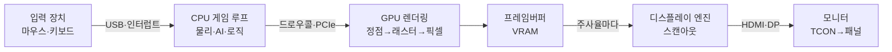
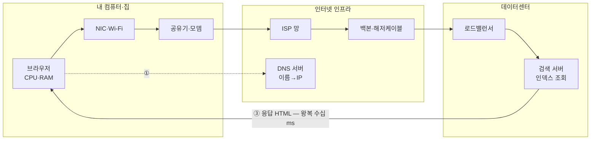
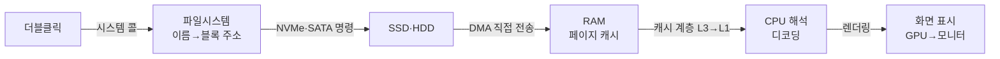
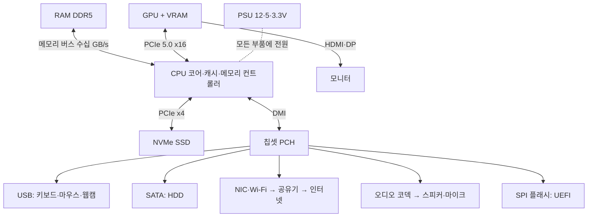

# 시나리오로 배우는 컴퓨터 아키텍처 — 예시 카탈로그와 하드웨어 전체 목록

> 컴퓨터 아키텍처는 부품 이름을 외우는 과목이 아니라, **일상의 동작 하나가 하드웨어를 어떤 경로로 통과하는지** 추적하는 공부다.
> 이 문서는 위키의 뼈대가 될 시나리오 16가지, 그중 4가지의 단계별 분석, 그리고 관여 하드웨어 전체 카탈로그를 정리한다.

---

## 1. 시나리오 카탈로그 — 위키 문서 후보 16선

| # | 시나리오 | 배우는 개념 | 핵심 하드웨어 |
|---|---|---|---|
| 01 | **컴퓨터가 켜지는 과정 (부팅)** ↓심층 | UEFI·POST·부트로더·커널 | PSU, SPI 플래시, CPU, RAM, SSD |
| 02 | **게임 조작이 화면이 되기까지** ↓심층 | 렌더링 파이프라인, input-to-photon | 입력장치, CPU, GPU, VRAM, 모니터 |
| 03 | **인터넷 검색 한 번의 왕복** ↓심층 | DNS, TCP/TLS, 라우팅 | NIC·Wi-Fi, 공유기, ISP, 데이터센터 |
| 04 | **드라이브의 파일이 화면에 보이기까지** ↓심층 | 파일시스템, DMA, 메모리 계층 | SSD·HDD, RAM, CPU 캐시, GPU |
| 05 | 키보드 입력이 글자가 되기까지 | 인터럽트, 스캔코드, 폰트 렌더링 | 키보드 컨트롤러, USB, CPU, GPU |
| 06 | 프로그램 더블클릭에서 실행까지 | 로더, 가상 메모리, 페이징 | SSD, RAM, CPU(MMU·TLB) |
| 07 | Ctrl+S 한 번의 여정 | 쓰기 버퍼, 저널링, 웨어 레벨링 | RAM, SSD 컨트롤러, NAND |
| 08 | 음악이 스피커에서 나오기까지 | 디코딩, 버퍼링, DAC, 샘플링 | CPU, 오디오 코덱, 앰프, 스피커 |
| 09 | 유튜브 스트리밍 | 적응형 스트리밍, 하드웨어 디코더 | NIC, CPU, GPU 비디오 디코더 |
| 10 | 화상통화 | 이미지 센서·ISP, 인코딩, UDP | 웹캠, 마이크(ADC), GPU 인코더, NIC |
| 11 | 여러 프로그램이 동시에 도는 법 | 스케줄링, 컨텍스트 스위칭, 메모리 보호 | CPU 코어, 타이머, MMU, RAM |
| 12 | USB를 꽂는 순간 | 버스 열거, 장치 ID, 드라이버 로딩 | USB 호스트 컨트롤러, 칩셋 |
| 13 | 절전 모드와 복귀 | 전원 상태 S0–S5, 셀프 리프레시 | PSU·배터리, RAM, EC, RTC |
| 14 | AI에게 질문할 때 | 행렬 곱 병렬화, 메모리 대역폭 | GPU·NPU, VRAM(HBM), 데이터센터 |
| 15 | 게임 로딩 화면의 정체 | 에셋 스트리밍, DirectStorage | NVMe SSD, PCIe, RAM, GPU |
| 16 | 화면 녹화·스크린샷 | 프레임버퍼 캡처, 하드웨어 인코더 | GPU(NVENC), VRAM, SSD |

그 밖의 소재: 복사·붙여넣기(클립보드), 블루투스 이어폰 지연, 프린터 스풀링, 파일 압축·해제(SIMD), 스크린 미러링, 배터리 충전 회로, 스마트폰 카메라의 연산 사진학.

---

## 2. 심층 분석 4선

### №1 컴퓨터가 켜지는 과정 (부팅)

1. **전원 공급** — 버튼 신호를 받은 메인보드가 PSU를 깨우고, PSU는 AC 220V를 DC 12V·5V·3.3V로 변환. 전압이 안정되면 `Power Good` 신호로 CPU 리셋 해제.
2. **펌웨어 실행** — CPU가 리셋 벡터(x86은 `0xFFFFFFF0`)에서 첫 명령을 읽음. 이 주소는 메인보드 **SPI 플래시 롬**의 UEFI 펌웨어로 연결. RAM 초기화 전이라 초기엔 CPU 캐시를 임시 메모리로 사용(Cache-as-RAM).
3. **POST(자가 점검)** — CPU·RAM(메모리 트레이닝)·GPU 점검·초기화. 이 시점부터 제조사 로고 표시. 실패 시 비프음·진단 LED.
4. **부트로더 로드** — UEFI가 NVMe·SATA 장치에서 EFI 시스템 파티션을 찾아 부트로더(Windows Boot Manager, GRUB)를 RAM에 적재.
5. **커널 적재** — 부트로더가 OS 커널·드라이버를 SSD→RAM으로 읽음. 커널이 장치 초기화, 파일시스템 마운트, 서비스 시작.
6. **로그인** — 그래픽 스택이 올라오면 GPU가 로그인 화면을 그림.

**관여 하드웨어**: PSU · VRM · 메인보드(칩셋) · SPI 플래시(UEFI) · RTC+CMOS 배터리 · CPU · RAM · SSD/HDD · GPU · 모니터

### №2 게임 조작이 모니터의 빛이 되기까지

1. **입력** — 마우스 광 센서·키 매트릭스 감지 → USB 호스트 컨트롤러가 최대 1000Hz 폴링 → 인터럽트 → OS 입력 이벤트.
2. **게임 루프(CPU)** — 입력 반영, 물리·충돌·AI·게임 로직 계산, 이번 프레임에 그릴 목록 확정.
3. **드로우콜** — DirectX·Vulkan 호출 → 드라이버가 GPU 명령으로 번역 → PCIe ×16으로 전송.
4. **GPU 렌더링** — 정점 셰이더(3D 변환) → 래스터화(삼각형→픽셀) → 픽셀 셰이더(색·조명·텍스처). 수천 셰이더 코어가 병렬 처리, 결과를 VRAM 프레임버퍼에 기록.
5. **스캔아웃** — 디스플레이 엔진이 주사율(60–240Hz)에 맞춰 프레임버퍼를 줄 단위로 읽어 HDMI·DP로 송출. V-Sync·가변 주사율(G-Sync·FreeSync)이 여기서 등장.
6. **발광** — 모니터 TCON이 픽셀 구동, 백라이트+액정(LCD) 또는 자발광(OLED). 클릭부터 여기까지 수십 ms — 이 지표가 input-to-photon latency.

**관여 하드웨어**: 마우스·키보드 · USB 호스트 컨트롤러 · CPU · RAM · PCIe · GPU · VRAM · HDMI/DP 케이블 · 모니터(스케일러·TCON·패널)

### №3 인터넷 검색 한 번의 왕복

1. **요청 준비** — 브라우저(CPU·RAM)가 검색 URL·HTTP 요청 구성.
2. **DNS 조회** — `www.google.com` → IP 주소. OS 캐시 → 공유기 → ISP DNS 순.
3. **연결 수립** — TCP 3-way 핸드셰이크 + TLS 암호화 협상. CPU의 AES-NI 명령이 가속.
4. **패킷의 여행** — NIC·Wi-Fi가 전기신호·전파로 변환 → 공유기 → 모뎀(광신호) → ISP → 백본·해저케이블 → 데이터센터. 라우터 수십 홉.
5. **서버 처리** — 로드밸런서가 서버로 분배, 인덱스 조회 후 HTML 회신. 전체 왕복 수십 ms.
6. **렌더링** — HTML 파싱 → DOM → 레이아웃·페인트 → GPU 합성 (№2 후반부와 동일 경로).

**관여 하드웨어**: (내부) CPU · RAM · NIC·Wi-Fi 모듈 / (외부) 공유기 · 모뎀·ONT · ISP 라우터 · 백본·해저케이블 · DNS 서버 · 로드밸런서 · 데이터센터 서버 · CDN

### №4 드라이브의 정보가 화면에 보이기까지

1. **열기 요청** — 더블클릭 → 파일 열기 시스템 콜.
2. **파일시스템** — NTFS·APFS·ext4가 파일 이름을 블록 주소로 변환. RAM 페이지 캐시에 있으면 디스크 생략(캐시 적중).
3. **장치 읽기** — NVMe 명령 큐로 읽기 명령. **SSD**: FTL 매핑 → NAND 셀 읽기(수십 µs). **HDD**: 헤드 이동+회전 대기(수 ms) — SSD가 ~100배 빠른 이유.
4. **DMA 전송** — 저장장치가 CPU 개입 없이 RAM에 직접 기록, 완료 시 인터럽트.
5. **해석** — CPU가 캐시 계층(L3→L2→L1) 경유로 읽어 디코딩·가공.
6. **표시** — GPU가 그려 모니터로 (№2 후반부와 동일).

**관여 하드웨어**: SSD(NAND·컨트롤러·DRAM 캐시) 또는 HDD(플래터·헤드·액추에이터·모터) · NVMe/SATA · DMA 엔진 · RAM · CPU 캐시 · GPU · 모니터

---

## 3. 하드웨어 전체 카탈로그

### 연산 (Processing)
- **CPU** — 코어(ALU·FPU·레지스터), 파이프라인, 분기 예측기, L1–L3 캐시, 메모리 컨트롤러, PCIe 컨트롤러, 내장 그래픽.
- **GPU** — 셰이더 코어 수천 개, VRAM, 비디오 인코더·디코더(NVENC 등), 디스플레이 엔진.
- **NPU** — AI 추론 전용 가속기(최신 노트북·스마트폰 SoC 내장).
- **보조 프로세서** — SSD 컨트롤러, 웹캠 ISP, 오디오 DSP, 키보드 컨트롤러 등 도처의 작은 컴퓨터들.

### 메모리 (Memory) — 전원 꺼지면 소멸
- **레지스터·캐시(SRAM)** — CPU 내부 최고속 기억. 레지스터 → L1 → L2 → L3 순으로 크고 느려지는 계층.
- **RAM(DDR5·LPDDR5)** — 주기억장치. 실행 중 프로그램·데이터 상주. 듀얼 채널 수십 GB/s.
- **VRAM(GDDR7·HBM)** — GPU 전용. 프레임버퍼·텍스처·AI 모델. 대역폭이 일반 RAM의 ~10배.

### 저장장치 (Storage) — 전원 꺼져도 유지
- **SSD(NVMe·M.2)** — NAND 플래시(TLC·QLC) + 컨트롤러 + DRAM 캐시. FTL 매핑, 웨어 레벨링. 수 GB/s.
- **HDD(SATA)** — 자기 플래터 + 헤드 + 액추에이터 + 스핀들 모터(5400·7200RPM). 용량당 가격 강점.
- **SPI 플래시 롬** — UEFI 펌웨어 저장. 부팅의 출발점.
- **기타** — SD카드·eMMC·UFS, 광학 드라이브, 아카이브 테이프.

### 기판·버스·전원 (Board & Power)
- **메인보드(PCB)** — CPU 소켓, DIMM·M.2·PCIe 슬롯, 칩셋(PCH: USB·SATA·네트워크 허브), RTC+CMOS 배터리, (노트북) EC.
- **버스** — PCIe 5.0(×16 GPU ~64GB/s, ×4 SSD), DMI(CPU↔칩셋), SATA, USB4·Thunderbolt.
- **PSU** — AC 220V → DC 12·5·3.3V. 안정 후 Power Good 신호. 노트북은 배터리+충전 회로.
- **VRM** — 12V를 CPU용 ~1V로 정밀 변환.
- **냉각** — 히트싱크·히트파이프·팬·수랭·서멀 페이스트. 못 식히면 스로틀링.

### 입출력 (I/O)
- **입력** — 키보드(키 매트릭스+컨트롤러), 마우스(광 센서), 터치스크린, 게임패드, 웹캠(센서+ISP), 마이크(+ADC), 지문 센서.
- **모니터** — 패널(IPS·VA LCD, OLED), 백라이트, TCON, 스케일러. 연결: HDMI·DisplayPort·USB-C.
- **소리** — 오디오 코덱(DAC·ADC) → 앰프 → 스피커·헤드폰.
- **I/O 컨트롤러** — USB 호스트 컨트롤러, 인터럽트 컨트롤러(APIC), DMA 엔진.

### 네트워크 (Network)
- **내 컴퓨터** — 이더넷 NIC(1G–10G), Wi-Fi 모듈(6E·7, 블루투스 콤보), 안테나.
- **집** — 공유기(라우터+스위치+AP), 모뎀·광 단자(ONT).
- **바깥 인프라** — ISP 교환국 라우터, 백본망, 해저 광케이블, IXP, CDN 엣지 서버.
- **데이터센터** — 랙 서버, 로드밸런서, 스위치, DNS 서버, AI 가속기 클러스터.

---

## 4. 전체 구조도

속도가 생명인 장치(RAM·GPU·NVMe SSD)는 CPU 직결, 느린 다수(USB·SATA·네트워크·오디오)는 칩셋이 모아서 전달.

## 5. 속도 감각 — 레지스터가 1초라면

| 계층 | 실제 지연 | 레지스터가 1초라면 |
|---|---|---|
| CPU 레지스터 | ~0.3 ns | 1초 |
| L1 캐시 | ~1 ns | 3초 |
| L3 캐시 | ~12 ns | 40초 |
| RAM (DDR5) | ~80 ns | 4분 30초 |
| NVMe SSD | ~50 µs | 이틀 |
| HDD | ~8 ms | 10개월 |
| 인터넷 왕복 | ~30 ms | 3년 |

캐시·RAM·페이지 캐시가 존재하는 이유, SSD가 컴퓨터를 "빠르게 느끼게" 하는 이유가 이 표에 있다.
